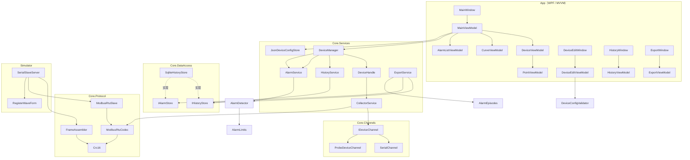

# DeviceMonitor 类参考手册

> 本文档对仓库中**全部类型**逐一说明：职责、关键成员、设计取舍、依赖关系与易踩的坑。
> 面向"接手本项目"和"面试前快速过一遍"两种用途。
>
> - 生成依据：当前工作树源码（`src/` / `tests/` / `tools/`，约 13 000 行 C#）
> - 配套文档：`docs/DeviceMonitor-Design.md`（需求与 28 天计划）、`docs/HANDOFF.md`（交接与坑清单）
> - 进度：D1 ~ D22 已完成，D23 ~ D28（鲁棒性收尾 / 录屏 / README / 简历）待做

---

## 0. 阅读指南

| 你想知道什么 | 看哪一节 |
|---|---|
| 项目整体长什么样 | §1 项目总览 |
| 配置怎么存、点位怎么定义 | §2 Core.Models |
| Modbus 报文怎么组、怎么解析 | §3 Core.Protocol |
| 串口怎么读、半包怎么办 | §4 Core.Channels |
| 采集怎么跑、多设备怎么编排、数据怎么落库 | §5 Core.Services |
| SQLite 表结构、查询规则 | §6 Core.DataAccess |
| 配置怎么校验、日志怎么写 | §7 Validation / Diagnostics |
| 界面怎么和 Core 对接（MVVM） | §8 App |
| 模拟器 / 控制台工具 | §9 §10 |
| 测试怎么组织 | §11 测试工程 |
| 一页纸速查 | §13 附录 |

---

## 1. 项目总览

### 1.1 一句话

一套运行在 PC 上的**串口设备采集监控上位机**：通过串口以 **Modbus RTU** 协议轮询一台或多台从站设备，实时显示寄存器值、绘制实时曲线、按上下限报警（带死区）、历史数据落 **SQLite**，并支持历史查询回放与 **Excel 报表导出**。项目同时自研了**主站协议栈**与**从站模拟器**，两侧互相验证。

### 1.2 解决方案结构

```
DeviceMonitor.sln
├─ docs/
│   ├─ DeviceMonitor-Design.md      # 需求 + 28 天计划 + 架构（权威）
│   ├─ HANDOFF.md                   # 交接文档 + 46 条坑清单
│   └─ DeviceMonitor-类参考手册.md   # 本文件
├─ src/
│   ├─ DeviceMonitor.Core/          # 类库 net8.0 —— 协议/通道/服务/存储/校验（不引用 WPF）
│   │   ├─ Models/                  # 配置模型 + 运行时模型 + 报警规则
│   │   ├─ Protocol/                # 自研 Modbus RTU 主站 + 从站逻辑
│   │   ├─ Channels/                # 通道抽象 + 串口实现 + 探针实现
│   │   ├─ Services/                # 采集/编排/落库/报警/导出/配置持久化
│   │   ├─ DataAccess/              # SQLite 存储 + 查询纯函数
│   │   ├─ Validation/              # 配置校验器
│   │   └─ Diagnostics/             # NLog 日志门面
│   ├─ DeviceMonitor.App/           # WPF net8.0-windows —— 界面层
│   │   ├─ ViewModels/              # 9 个 VM + 4 个界面用记录类型
│   │   ├─ Views/                   # 4 个窗口（XAML + code-behind）
│   │   └─ Converters/              # 3 个 IValueConverter
│   └─ DeviceMonitor.Simulator/     # 控制台 —— Modbus RTU 从站模拟器
├─ tools/
│   └─ DeviceMonitor.MasterConsole/ # 控制台主站（不依赖 UI 的端到端验证工具）
└─ tests/
    └─ DeviceMonitor.Core.Tests/    # xunit v3，23 个测试类 / 约 350 个用例
```

### 1.3 依赖规则（铁律，改动时必须守住）

```
App ──────────► Core
Simulator ────► Core
MasterConsole ► Core
Tests ────────► Core
```

1. **`Core` 不引用 WPF、不引用绘图库**（ScottPlot 只出现在 `App`）。
   → 好处：协议与采集逻辑可脱离 UI 单测，未来可被服务端程序复用。
2. **协议层自研**，不引 HslCommunication 之类的现成库 —— 这是简历的核心卖点。
3. **Core 只依赖 4 个外部包**：`System.IO.Ports`、`NLog`、`Microsoft.Data.Sqlite`、`ClosedXML`。
4. **端口约定**：`COM9`/`COM11` = 上位机侧，`COM10`/`COM12` = 模拟器侧。

### 1.4 技术栈

| 技术 | 版本 | 用途 | 出现在 |
|---|---|---|---|
| .NET | 8.0 / net8.0-windows | 运行时 | 全部 |
| CommunityToolkit.Mvvm | 8.4.2 | `[ObservableProperty]` / `[RelayCommand]` 源生成器 | App |
| Microsoft.Extensions.DependencyInjection | 8.0.0 | DI 容器 | App |
| ScottPlot.WPF | 5.1.59 | 实时曲线 / 历史回放 | App |
| System.IO.Ports | 10.0.10 | 串口 | Core |
| Microsoft.Data.Sqlite | 8.0.6 | 历史库 | Core |
| ClosedXML | 0.105.1 | Excel 导出 | Core |
| NLog | 4.7.12 | 日志 | Core + 三个可执行项目 |
| xunit.v3 | 3.2.2 | 单测 | Tests |

### 1.5 三条数据流（理解全项目的钥匙）

```
① 采集（每设备一条后台轮询任务，生产者）
   DiscardInBuffer → Write(BuildReadRequest) → ReadFrame(期望长度, 超时)
   → TryParseReadResponse → 发布 DataSample 到 CollectorService.Samples
     （有界 10 000 条 / DropOldest / 单写者）

② 汇总（DeviceManager 的 N 个"泵"任务，扇出）
   CollectorService.Samples  →  Sample（UI 流，容量 20 000，DropOldest）
                             →  HistorySamples（存储流，容量 100 000，Wait）
   ★ 必须扇出成两条：Channel 的多个 reader 是竞争关系，共用一个会各拿一半样本

③ 上屏（MainViewModel）
   状态流：DeviceStatusChanged（采集线程）→ Dispatcher.Invoke → 刷 DeviceViewModel
   样本流：后台消费 Sample → 按 (设备Id, 点位Id) 只留最新值 → 每 150ms 批量
          Dispatcher → PointViewModel.Apply + CurveViewModel.Append + EndBatch
```

报警判定（D21）挂在 `②` 的泵里 —— 那里同时握着样本、设备配置和点位索引，不必再开一条通道。

### 1.6 生产类型总览（67 个）

| 命名空间 | 类型数 | 主要类型 |
|---|---|---|
| `Core.Models` | 16 | DeviceConfig、PointConfig、DeviceRuntime、DataSample、HistorySample、AlarmRecord、AlarmDetector、AlarmLimits、AlarmEpisode(s) |
| `Core.Protocol` | 8 | Crc16、ModbusRtuCodec、FrameAssembler、ModbusRtuSlave、ModbusRequest、ModbusExceptionCode(Descriptions)、FrameDirection |
| `Core.Channels` | 4 | IDeviceChannel、IDegradableDeviceChannel、SerialChannel、ProbeDeviceChannel |
| `Core.Services` | 10 | CollectorService、DeviceManager、DeviceHandle、HistoryService、AlarmService、ExportService、ExportRequest/Result、JsonDeviceConfigStore |
| `Core.DataAccess` | 4 | IHistoryStore、IAlarmStore、SqliteHistoryStore、HistoryQuery |
| `Core.Validation` | 1 | DeviceConfigValidator |
| `Core.Diagnostics` | 1 | AppLog |
| `App` / `App.ViewModels` / `App.Converters` | 20 | App、8 个 ViewModel、4 个窗口、3 个转换器、4 个界面记录类型（AlarmRow / PointOption / HistoryRow / TimePreset） |
| `Simulator` | 3 | SerialSlaveServer、RegisterWaveForm、WaveFormKind（+ 顶层 `Program`） |

> 小计：16 + 8 + 4 + 10 + 4 + 1 + 1 + 20 + 3 = **67**。
| `MasterConsole` | 0（顶层语句程序） | — |

---

## 2. Core.Models —— 模型与领域规则

> 这一层是**纯 POCO + 纯函数**：没有 IO、没有线程、没有 UI 依赖。
> 因此所有"规则"（限值比较、死区状态机、报警配对）都能完整单测 —— 这是全项目可测性的地基。

### 2.1 `DeviceConfig`

- **文件**：`src/DeviceMonitor.Core/Models/DeviceConfig.cs`
- **类型**：`public sealed class`（可变 POCO，供 `System.Text.Json` 序列化）
- **职责**：一台设备的全部配置 —— 串口参数 + 从站地址 + 超时/轮询策略 + 点位表。
- **对应**：设计文档 §6.1；持久化为 `devices.json` 的一个数组元素。

| 成员 | 类型 | 默认值 | 说明 |
|---|---|---|---|
| `Id` | `string` | `string.Empty` ⚠️ | 设备唯一 Id；**故意不是 `Guid.NewGuid()`**，见下方要点 |
| `Name` | `string` | `"新设备"` | 设备名 |
| `PortName` | `string` | `"COM9"` | 上位机侧端口 |
| `BaudRate` | `int` | 9600 | 波特率 |
| `DataBits` | `int` | 8 | 数据位 |
| `Parity` | `System.IO.Ports.Parity` | `None` | 校验位 |
| `StopBits` | `System.IO.Ports.StopBits` | `One` | 停止位 |
| `SlaveId` | `byte` | 1 | Modbus 从站地址（1~247） |
| `ReadTimeoutMs` | `int` | 800 | 单帧响应超时 |
| `PollIntervalMs` | `int` | 1000 | 轮询周期 |
| `Points` | `List<PointConfig>` | 空表 | 采集点 |
| `OfflineErrorThreshold` | `int` | 3 | 连续失败达此值判定离线 |
| `ReconnectIntervalMs` | `int` | 5000 | 离线后退避重连间隔（默认演示设备用 2000） |

**★ 设计要点（面试可讲 + 坑）**

- **`Id` 默认空串是刻意的**（HANDOFF 坑 #25）。`System.Text.Json` 反序列化时，若 JSON 里缺该字段，会**保留属性初始化器的值**。如果这里写 `Guid.NewGuid()`，那么每次加载配置文件都会得到一批**全新的随机 Id**；而 Id 是 UI 索引键 `(DeviceId, PointId)`、历史表主键、报警表的关联键 —— 结果就是"同一台设备的同一点位"跨次启动被当成两回事，而且判断"缺 Id"的 `string.IsNullOrWhiteSpace` 永远为 false，补齐逻辑**静默失效**。
  → **职责划分**：模型给空串，**补齐交给 `JsonDeviceConfigStore.Load`**（补完写回文件）。
- 该类型是**可变**的（`set` 全开放），因为要配合 DataGrid / JSON 序列化；所以采集端在 `CollectorService` 构造函数里**快照**了启用点位，避免运行期被外部改动。
- 校验规则见 §7.1 `DeviceConfigValidator`；持久化见 §5.1 `JsonDeviceConfigStore`。

**依赖**：`System.IO.Ports`（`Parity`/`StopBits`）。
**被依赖**：几乎所有类型（通道、采集、管理、存储、导出）。

---

### 2.2 `PointConfig`

- **文件**：`src/DeviceMonitor.Core/Models/PointConfig.cs`
- **类型**：`public sealed class`
- **职责**：一个寄存器采集点 —— 读哪段寄存器、怎么换算、限值多少。

| 成员 | 类型 | 默认值 | 说明 |
|---|---|---|---|
| `Id` | `string` | `string.Empty` ⚠️ | 同 `DeviceConfig.Id`，必须由 store / 编辑窗口补齐 |
| `Name` | `string` | `"新点位"` | 点名，如"温度" |
| `FunctionCode` | `byte` | 3 | **只支持 3（保持寄存器）/ 4（输入寄存器）** |
| `StartAddress` | `ushort` | 0 | 起始地址（从 0 计） |
| `Quantity` | `ushort` | 1 | 连续寄存器个数（1~125） |
| `Unit` | `string` | 空 | 单位，如 `℃` |
| `Scale` | `double` | 1.0 | 工程值 = `raw × Scale` |
| `Decimals` | `int` | 1 | 界面小数位（0~6） |
| `AlarmHigh` | `double?` | null | 报警上限（null = 不启用上限） |
| `AlarmLow` | `double?` | null | 报警下限 |
| `AlarmDeadband` | `double` | 0 | **报警死区**（见下） |
| `Enabled` | `bool` | true | 是否参与采集 |
| `ExpectedResponseLength` | `int`（只读计算） | — | `5 + 2 × Quantity` |

**★ 设计要点**

- **`ExpectedResponseLength`** 是半包处理的基础：主站侧"一问一答"，帧长可预期 —— 读响应固定 `5 + 2N` 字节（地址 1 + 功能码 1 + 字节数 1 + 数据 2N + CRC 2）。`SerialChannel.ReadFrame` 就按它决定"收齐了没"。
- **`AlarmDeadband` 的语义**：进入与退出用**两个不同阈值**
  - 进报警：`value > High`
  - 出报警：`value <= High - deadband`
  - 夹在 `(High - deadband, High]` 之间的波动**不产生任何记录** —— 这就是"不抖屏"的技术含义。
  - `0` = 退化回"越过即报、回线即恢复"，与 D17 报警灯语义一致。
- ⚠️ **DataGrid 直接编辑 POCO 收不到通知**：本类型**不实现 `INotifyPropertyChanged`**（Core 不该依赖 UI 通知机制，边界要守住）。所以在 `DeviceEditWindow` 里改"数量/缩放"这类字段，ViewModel 完全不知情 → 必须靠 View 层的 `DataGrid.CellEditEnding` + `Dispatcher.BeginInvoke` 延后重校验（HANDOFF 坑 #33）。

**依赖**：无。
**被依赖**：`DeviceConfig`、`DeviceConfigValidator`、`CollectorService`、`AlarmDetector`、`AlarmService`、`ExportService`、`PointViewModel` 等。

---

### 2.3 `DeviceState`（枚举）与 `DeviceRuntime`

- **文件**：`src/DeviceMonitor.Core/Models/DeviceState.cs`（两个类型同文件）

**`DeviceState`** —— 设备在线状态机：

| 值 | 含义 | 由谁设置 |
|---|---|---|
| `Offline` | 离线（未开始 / 连续失败达阈值 / 已停止） | `CollectorService` |
| `Connecting` | 正在打开通道 | 同上 |
| `Online` | 本轮轮询成功 | 同上 |
| `Error` | 单次/少数失败，仍在容忍范围内 | 同上 |

**`DeviceRuntime`** —— 运行时状态（UI 绑定用，由 `CollectorService` 更新并发布）：

| 成员 | 类型 | 说明 |
|---|---|---|
| `State` | `DeviceState` | 当前状态，默认 `Offline` |
| `ConsecutiveErrors` | `int` | 连续失败次数（成功后清零） |
| `LastSuccessUtc` | `DateTime?` | 最近一次成功轮询（UTC） |
| `TotalSamples` | `long` | 累计样本数 |
| `LastError` | `string?` | 最近失败原因（成功后清空） |

**状态机流转**（实现在 `CollectorService.RunAsync`）：

```
                 ┌───────────── 轮询成功 ─────────────┐
                 ▼                                    │
Offline ──Open──► Connecting ──成功──► Online ────失败(未达阈值)──► Error
   ▲                                   │                              │
   └──── 停止 / 连续失败达阈值 ◄────────┴───────── 达阈值 ────────────┘
                                                  (退避重连 ReconnectIntervalMs)
```

**注意**：`Runtime` 是**可变对象**且被多线程读写（采集线程写、UI 读）。这是刻意的取舍 —— 用对象复用换取"UI 不重建对象"，代价是不能跨线程做"读-改-写"复合操作。

---

### 2.4 `DataSample`

- **文件**：`src/DeviceMonitor.Core/Models/DataSample.cs`
- **类型**：`public sealed record`（不可变值对象）

```csharp
public sealed record DataSample(
    DateTime Utc, string DeviceId, string PointId,
    string PointName, double Raw, double Display, string Unit);
```

- **职责**：**采集产生的一条样本**，是采集线程 → UI / 存储 的唯一数据载体。
- `Raw` = 寄存器原始值；`Display` = `Raw × Scale`（工程值）；`PointName` 在多寄存器点位下带下标（如 `温度[2]`）。
- `ToString()` 重写为 `[HH:mm:ss.fff] 设备/点名 = 值 单位 (raw=...)`，方便控制台打印与日志。

**与 `HistorySample` 的区别**（别混用）：

| | `DataSample` | `HistorySample` |
|---|---|---|
| 来源 | 采集服务发布 | 从 SQLite 读回 |
| 字段 | 7 个（含 PointName / Unit） | 4 个（ts/device/point/value） |
| 用途 | 实时上屏、落库输入 | 历史表格、曲线回放、导出 |

---

### 2.5 `HistorySample`

- **文件**：`src/DeviceMonitor.Core/Models/HistorySample.cs`
- **类型**：`public sealed record(DateTime TsUtc, string DeviceId, string PointId, double Value)`
- **职责**：`history` 表一行的内存表示，**与设计文档 §6.5 表结构一一对应**。

**★ 刻意不在库里存点名和单位**：它们是"配置"，改了配置历史就该跟着变；存两份必然出现"库里的单位和界面不一致"。代价是显示时要现查配置（`ExportService` / `HistoryViewModel` 用 `PointId → PointConfig` 字典）。

---

### 2.6 `AlarmKind`（枚举）与 `AlarmRecord`

- **文件**：`src/DeviceMonitor.Core/Models/AlarmRecord.cs`

**`AlarmKind`**：

| 值 | 含义 |
|---|---|
| `High` | 超过上限 |
| `Low` | 低于下限 |
| `Recovered` | 回落出死区、报警解除（`Value` 是恢复时刻的值） |

**★ 为什么要有 `Recovered`**：只记"报警产生"的话，事后无法知道这条报警**持续了多久**（Excel 报表那一列就没法算）。产生与恢复各记一条 → 报警有了完整生命周期，代价只是报警量翻倍 —— 而报警本身是低频事件。
（这个决定后来在 D22 派上了用场：`AlarmEpisodes` 就是把这两条配成"一条事件"。）

**`AlarmRecord`**：`record(DateTime Utc, string DeviceId, string PointId, string PointName, double Value, AlarmKind Kind, string Message)`

- 同时带 `PointId`（库里按 `(device_id, point_id)` 存）和 `PointName`（界面要显示）—— **别指望用名字反查 Id**。
- ⚠️ `alarm_log` 表比设计文档**多存了一列 `point_name`**：报警是"事件存档"，应该**冻结当时的名字**，不能因为后来改了配置就跟着变（样本那边则有意接受这个耦合）。

---

### 2.7 `AlarmLevel`（枚举）与 `AlarmLimits`

- **文件**：`src/DeviceMonitor.Core/Models/AlarmLevel.cs`

**`AlarmLevel`**：`Normal` / `High` / `Low` —— 描述"**此刻的值处于什么位置**"（瞬时判断，**不含死区**）。

> 与 `AlarmKind` 的区别：`AlarmKind` 描述"产生了一条什么报警记录"（只有 High/Low，配 `AlarmRecord`）；`AlarmLevel` 多一个 `Normal`，供 UI 报警灯使用。**别搞混**。

**`AlarmLimits`**（静态类，纯函数）：

```csharp
public static AlarmLevel Classify(double value, double? alarmHigh, double? alarmLow)
```

- **边界约定**：**严格大于上限 / 严格小于下限才算越限**（`value == high` 视为正常）。这条必须用测试钉住 —— 否则将来有人改成 `>=`，刚好压线的点会莫名报警。
- 先判上限：万一配置里 `low > high`（校验器本该拦住，但展示层不该假设数据一定合法），优先报"超上限"，语义上更严重也更直观。
- **不做去抖、不产生记录、不写库** —— 那些是 `AlarmDetector` / `AlarmService` 的职责。这样切分的好处：D21 直接复用这里的比较结果再叠加状态位，而不是把比较逻辑写两遍。

---

### 2.8 `AlarmDetector` ★

- **文件**：`src/DeviceMonitor.Core/Models/AlarmDetector.cs`
- **类型**：`public sealed class`
- **职责**：**报警状态机** —— 在 `AlarmLimits.Classify` 的瞬时判断之上叠加"该点位此刻是否已在报警中"的状态位，实现**死区去抖**，并决定"本次该产生哪些记录"。

**核心成员**

| 成员 | 说明 |
|---|---|
| `_active` | `Dictionary<(DeviceId, PointId), AlarmKind>` —— 当前正在报警的点位；`_gate` 保护（多设备泵并发调用） |
| `ActiveCount` | 当前报警点位数（状态栏用） |
| `Evaluate(deviceId, point, value, utc)` | **推进状态机**，返回本次该产生的记录列表 |
| `ForgetDevice(deviceId)` | 设备被移除时清掉它的状态 |
| `Reset()` | 全部清空（停采集时用） |

**`Evaluate` 的返回语义**：绝大多数样本返回空（走 `Array.Empty`，零分配）；越限或恢复返回 1 条；**"从上限区直接跌进下限区"返回 2 条**（先恢复、后报警，两条都不丢）。

**★ 边界约定（都有对应单测）**

| 场景 | 行为 |
|---|---|
| `deadband = 0` | 退化成"越过即报、回线即恢复" |
| 只配单边限值 | 另一边永不参与判定 |
| 值从上限区直接跌进下限区 | 记一条上限恢复 + 一条下限报警 |
| 中途把限值清空 | 自动解除该点位报警状态（不会"卡死在报警中"） |
| 死区为负数 | 按 0 处理（防御性兜底）——负数会让"退出阈值"跑到进入阈值反面，一旦报警永远恢复不了 |
| 用 `Describe()` | 消息里点位带单位（`温度(℃)`），更好读；无单位时不出现空括号 |

**设计取舍**：为什么单独成一个类？因为这是**纯逻辑** —— 没有 IO、没有线程、时间由调用方传入，所以"进/出/在死区间隙里来回摆"这些分支可以用单测完整钉死。与 `AlarmLimits`、`DeviceConfigValidator` 同一思路：**规则放 Core，界面只负责展示**。

**被谁调用**：`AlarmService.Evaluate`（由 `DeviceManager` 的样本泵在采集线程上调用）。

---

### 2.9 `AlarmEpisode` 与 `AlarmEpisodes` ★

- **文件**：`src/DeviceMonitor.Core/Models/AlarmEpisode.cs`
- **引入于**：D22（Excel 报表需要"持续时长"）

**`AlarmEpisode`** —— 一条**完整的报警事件**（从触发到恢复）：

```csharp
public sealed record AlarmEpisode(
    string DeviceId, string PointId, string PointName, AlarmKind Kind,
    DateTime StartUtc, double StartValue,
    DateTime? EndUtc, double? EndValue, string Message)
{
    public TimeSpan? Duration  => EndUtc is DateTime end ? end - StartUtc : null;
    public bool IsOnGoing      => EndUtc is null;
    public string KindText     => Kind == AlarmKind.High ? "超上限" : "低于下限";
}
```

- `Duration` 未恢复时返回 `null`（**而不是拿"现在"去减** —— 那会让每次导出结果都不一样）。
- `Kind` 只会是 `High` / `Low`（`Recovered` 是记录流的概念，配对后消失）。

**`AlarmEpisodes`**（静态类）—— 把报警记录流配对成事件：

```csharp
public static IReadOnlyList<AlarmEpisode> Build(IReadOnlyList<AlarmRecord> records)
```

**要求输入按时间升序**（查询接口就是这么返回的）。三种"对不上"的情况都是**有意处理**：

| 情况 | 处理方式 | 理由 |
|---|---|---|
| 区间开头就是一条 `Recovered` | 跳过 | 报警发生在查询区间之前；硬凑"结束有、开始没有"的记录比不显示更糟 |
| 同一 `(设备,点位)` 上一条还没恢复又来新报警 | 旧的按"未恢复"收尾，再开新的 | 数据异常（正常状态机不会产生）；宁可多一条不完整的，也不要覆盖丢掉 |
| 区间结尾仍未恢复 | 保持 `EndUtc = null` | 报表显示"进行中" |

输出按 `StartUtc` 升序。纯函数 → 可以完整单测（`AlarmEpisodesTests`，10 条用例）。

---

### 2.10 `ValidationScope` / `ValidationError` / `ValidationResult`

- **文件**：`src/DeviceMonitor.Core/Models/ValidationResult.cs`

| 类型 | 定义 | 说明 |
|---|---|---|
| `ValidationScope`（枚举） | `Device` / `Point` | 错误范围 |
| `ValidationError`（record） | `(Scope, Target, Field, Message)` | 单条错误：定位到"哪台设备/哪个点位/哪个字段" |
| `ValidationResult`（record） | `(IReadOnlyList<ValidationError> Errors)` | 汇总结果 |

**`ValidationResult` 的关键成员**

- `ValidationResult.Ok` —— 静态只读的空结果（复用，避免每次 new）。
- `IsValid` —— `Errors.Count == 0`。
- `ToDisplayText()` —— 拼成多行文本，每行 `• <消息>`，直接喂给界面提示条。

**★ 为什么不用 `ArgumentException` 直接抛**：UI 编辑窗口需要把**多条**错误一次性摊开给用户（比如同时有两个点位数量超限），而不是逐条弹窗。所以校验器返回"全部错误"，而不是"第一条"。

---

## 3. Core.Protocol —— 自研 Modbus RTU 协议栈

> 简历含金量最高的一层。主站（请求组帧 + 响应解析）与从站（请求解析 + 响应组帧）**两侧都在 Core 里**，因此可以互相验证，且完全可单测。

**报文结构（面试必背）**

| 帧 | 组成 | 长度 |
|---|---|---|
| 读请求（03/04） | 从站地址(1) + 功能码(1) + 起始地址(2, 高字节在前) + 数量(2, 高字节在前) + CRC16(2, 低字节在前) | **8** |
| 正常响应 | 地址 + 功能码 + 字节数(1, =2N) + 数据(2N, 每寄存器高字节在前) + CRC | **5 + 2N** |
| 异常响应 | 地址 + (功能码\|0x80) + 异常码(1) + CRC | **5** |

### 3.1 `Crc16`

- **文件**：`src/DeviceMonitor.Core/Protocol/Crc16.cs`
- **类型**：`public static class`

| 方法 | 签名 | 说明 |
|---|---|---|
| `Compute` | `ushort Compute(ReadOnlySpan<byte> data)` | 初值 `0xFFFF`、多项式 `0xA001`（反射形式）、逐字节异或移位 |
| `AppendLittleEndian` | `byte[] AppendLittleEndian(byte[] frame, ushort crc)` | 按 Modbus 规定**低字节在前**追加，返回完整帧 |

**已知向量**：`01 03 00 00 00 0A` → CRC = `0xCDC5`（发送顺序 `C5 CD`）。
**性质**：完整合法帧再算一次 CRC 结果为 0 —— `TryParseRequest` 与 `FrameAssembler` 的校验都靠这条。

---

### 3.2 `ModbusRtuCodec` ★

- **文件**：`src/DeviceMonitor.Core/Protocol/ModbusRtuCodec.cs`
- **类型**：`public static class`
- **常量**：`MaxReadQuantity = 125`

| 方法 | 方向 | 说明 |
|---|---|---|
| `BuildReadRequest(slaveId, fc, start, qty)` | 主站发 | 组 8 字节读请求；参数非法抛 `ArgumentOutOfRangeException`（SlaveId 1~247、fc 仅 3/4、qty 1~125、`start + qty - 1 ≤ 65535`） |
| `TryParseReadResponse(frame, slaveId, fc, out values, out errorCode)` | 主站收 | 解析读响应。返回 `true` = 正常；`false` + `errorCode != null` = 从站异常响应；`false` + `errorCode == null` = 帧不可信 |
| `TryParseRequest(frame, out request)` | 从站收 | 解析主站请求。**不做从站地址过滤**（由调用方决定要不要响应）；未支持的功能码也照常返回，以便回一个"非法功能码"异常，而不是静默丢弃 |
| `BuildReadResponse(slaveId, fc, values)` | 从站发 | 组读响应（地址 + 功能码 + 字节数 + 数据 + CRC） |
| `BuildWriteResponse(slaveId, fc, start, valueOrQuantity)` | 从站发 | 组写响应（06/10 布局相同，仅第 4 个 16 位字段含义不同） |
| `BuildExceptionResponse(slaveId, fc, code)` | 从站发 | 组异常响应（5 字节） |

**`TryParseReadResponse` 的 7 步校验**（顺序有讲究）：
1. 功能码参数非法 → **抛异常**（调用方编程错误，与 `BuildReadRequest` 一致）
2. `frame.Length < 5` → false（最小合法帧是 5）
3. 从站地址不匹配 → false（通常是上一帧残留）
4. 功能码 ≠ 期望值 且 ≠ `期望值|0x80` → false
5. **CRC 校验放在异常分支之前** —— 异常帧本身也要保证完整可信
6. 异常响应：必须是 5 字节，取异常码
7. 正常响应：字节数非零、偶数、≤ 250；且 `frame.Length == byteCount + 5`（**少字节/多字节都判失败**）

**★ 06 功能码的坑**：请求第 5~6 字节是"**要写入的值**"，不是数量！`TryParseRequest` 统一成 `Quantity = 1` + `Data = [值]`。

---

### 3.3 `ModbusRequest`

- **文件**：`src/DeviceMonitor.Core/Protocol/ModbusRequest.cs`
- **类型**：`record(byte SlaveId, byte FunctionCode, ushort StartAddress, ushort Quantity, ushort[] Data)`

| 情形 | Data / Quantity 约定 |
|---|---|
| 读请求（03/04） | `Data` 为空，`Quantity` = 要读的个数 |
| 写单个（06） | `Quantity = 1`，`Data = [要写入的值]` |
| 写多个（10） | `Quantity = N`，`Data = N 个值` |
| 未知功能码 | `StartAddress = 0`、`Quantity = 0`、`Data` 为空 |

---

### 3.4 `ModbusExceptionCode`（枚举）与 `ModbusExceptionDescriptions`

- **文件**：`src/DeviceMonitor.Core/Protocol/ModbusExceptionCode.cs`

**枚举 `: byte`**：

| 值 | 名称 | 含义 |
|---|---|---|
| `0x01` | `IllegalFunction` | 非法功能码：从站不支持该功能 |
| `0x02` | `IllegalDataAddress` | 非法数据地址：地址 + 数量超范围 |
| `0x03` | `IllegalDataValue` | 非法数据值：数量/字节数等不合法 |
| `0x04` | `SlaveDeviceFailure` | 从站设备故障 |

**`ModbusExceptionDescriptions`**（静态类）：`Describe(code)` / `Describe(byte)` → 中文说明，**主站从站两侧共用**（日志与界面显示）。

---

### 3.5 `FrameDirection`（枚举）与 `FrameAssembler` ★

- **文件**：`src/DeviceMonitor.Core/Protocol/FrameAssembler.cs`

**`FrameDirection`**：`SlaveRequest`（默认，从站解析主站请求）/ `MasterResponse`（主站解析从站响应）—— 两个方向的帧长规则不同，必须区分。

**`FrameAssembler`** —— **字节流 → 完整 Modbus RTU 帧**的组装器。

> **为什么需要它**：串口一次 `Read` 不一定恰好读回一帧（**半包**），也可能帧后夹着下一帧（**粘包**）。
> **主站侧**策略被简化了（见 §4.2 `SerialChannel.ReadFrame`）：一问一答 + 帧长可预期 → 循环读到期望长度即可。
> **本类**主要服务于需要"按 3.5 字符空闲判帧"的**从站侧**（模拟器）与通用场景。

**构造参数**

| 参数 | 默认 | 说明 |
|---|---|---|
| `direction` | `SlaveRequest` | 帧长推断方向 |
| `frameGap` | `FrameGapFor(9600)` | 帧间空闲阈值 |
| `validateCrc` | true | 是否 CRC 校验并据此失步重同步 |
| `clock` | `() => DateTime.UtcNow` | **时间源注入** → 空闲判界可确定性单测（`FakeClock`） |

**`FrameGapFor(baudRate, bitsPerCharacter = 11)`**：3.5 字符时间 = `3.5 × 11 × 1000 / baud`，向上取整到毫秒（9600 波特 ≈ 5ms）。波特率 ≤ 0 抛异常。

**核心机制**

| 机制 | 实现 |
|---|---|
| `Feed(chunk)` | 与上一段间隔超 `frameGap` → 先丢弃残帧；追加字节并更新 `_lastFeedUtc` |
| 帧长推断 `TryResolveLength` | 按方向 + 功能码：异常响应固定 5；`SlaveRequest` 的 01~06 固定 8、0F/10 = `9 + 字节数`；`MasterResponse` 的 01~04 = `5 + 字节数`、05/06/0F/10 固定 8；未知功能码返回 false → 退回"帧间空闲判界" |
| **失步重同步** | 长度够但 CRC 不符 → **只 `RemoveAt(0)` 滑掉 1 个字节**重新对齐（注意必须是 `RemoveAt`，`List<byte>.Remove(0)` 是"删第一个值为 0 的元素"！见 HANDOFF 坑 #6） |
| 窥视再取 | 先 `GetRange` 复制候选帧校验，**通过才真正取走** —— 否则 CRC 失败时候选帧白丢，重同步失效 |
| 残帧超时丢弃 | 帧长已知却没收齐，且空闲超阈值 → `Clear()` |

---

### 3.6 `ModbusRtuSlave` ★

- **文件**：`src/DeviceMonitor.Core/Protocol/ModbusRtuSlave.cs`
- **类型**：`public sealed class`
- **职责**：**Modbus RTU 从站逻辑（纯内存，不碰串口）** —— 维护寄存器区，按请求构造响应。
  → 串口收发由 `SerialSlaveServer` 负责，所以本类**完全可单元测试**。

**成员**

| 成员 | 说明 |
|---|---|
| `ModbusRtuSlave(slaveId, registerCount = 100)` | 构造；SlaveId 1~247、registerCount ≥ 1，否则抛异常 |
| `HoldingRegisters` : `Span<ushort>` | 保持寄存器区（FC03 读、06/10 写）。模拟器**只在启动时**赋 `i*10`，不参与波形刷新 |
| `InputRegisters` : `Span<ushort>` | 输入寄存器区（FC04 只读）。**模拟器每轮刷新这里**（⚠️ 见下） |
| `HandledCount` / `ExceptionResponseCount` / `DiscardedFrameCount` / `IgnoredForOtherSlaveCount` | 四类计数，控制台状态行用 |
| `HandleRequest(request)` | 处理一帧，返回响应帧；`null` = 不响应 |

**`HandleRequest` 的分派**：

| 功能码 | 行为 |
|---|---|
| `0x03` | 读保持寄存器 |
| `0x04` | 读输入寄存器 |
| `0x06` | 写单个寄存器（更新 + 回显） |
| `0x10` | 写多个寄存器（数量 0 或 >123 → 异常码 03；数据长度与数量不符 → 03；地址越界 → 02） |
| 其他 | 异常码 `01`（非法功能码） |

**返回 `null`（不响应）的两种情况**：帧不合法（CRC/结构，`DiscardedFrameCount++`）、地址不是发给本从站的（`IgnoredForOtherSlaveCount++`）。

**★★ 全项目最容易踩的坑（HANDOFF 坑 #36）**：
模拟器的波形**只写进输入寄存器**，保持寄存器只有启动时的 `i*10` 且**永不更新**。
→ **新建点位若用默认功能码 3，读数永远是 `0,10,20,30,40,50`**，看起来像"采不到数据/软件坏了"。
→ **排查"数值不动"时这是第一优先项**：把点位功能码改成 **4**。

---

## 4. Core.Channels —— 设备通道抽象

> 抽象的意义：`IDeviceChannel` 让采集/编排逻辑**完全脱离硬件** —— 测试注入假通道即可；将来加 `TcpChannel` 就能支持 Modbus TCP，UI 与采集服务无需改动。

### 4.1 `IDeviceChannel` 与 `IDegradableDeviceChannel`

- **文件**：`src/DeviceMonitor.Core/Channels/IDeviceChannel.cs`

```csharp
public interface IDeviceChannel : IDisposable
{
    bool IsOpen { get; }
    void Open();
    void Close();
    void DiscardInBuffer();
    void Write(ReadOnlySpan<byte> frame);
    byte[]? ReadFrame(int expectedLength, int timeoutMs);
}
```

**通信语义约定为"一问一答"**：`Write(frame)` 发请求 → `ReadFrame(期望长度, 超时)` 取回完整响应帧。
**实现必须线程安全**：同一时刻只有一个轮询线程在使用通道。

**`IDegradableDeviceChannel`** —— 标记接口（无成员）：表示"**`Open` 失败后不抛异常**，保持未打开状态，让调用方照常走重连流程"。

> **为什么需要这个区分**：`CollectorService` 遇打开失败会记一次错误并按阈值判离线（正常路径）。但如果不加区分，任何实现都可以"静默失败"，把真 bug（比如过滤器写错导致零帧）伪装成"设备离线"。
> 因此**只有显式声明本接口的通道**（当前仅 `ProbeDeviceChannel`）才允许 Open 失败后继续运行；真实 `SerialChannel` 打开失败仍然抛异常。

---

### 4.2 `SerialChannel` ★

- **文件**：`src/DeviceMonitor.Core/Channels/SerialChannel.cs`
- **类型**：`public sealed class : IDeviceChannel`
- **职责**：封装 `System.IO.Ports.SerialPort`，提供线程安全的读写。

**关键决策**

| 决策 | 理由 |
|---|---|
| **同步 `Read` + `ReadTimeout`**，由设备专属轮询线程独占 | 与 `DataReceived` 事件**二选一**（混用会双读竞争）。设计文档常见坑 #3 |
| `Write → ReadFrame` 用**一把 `_ioLock`** 保证原子 | 防止重连线程或外部打断插入中间状态 |
| `Open`/`Close` **幂等** | 重复调用无副作用；`Close` 先把 `_port` 摘成 null 再关，避免回调拿到半死对象 |
| 打开失败**向上抛异常** | 转为 `InvalidOperationException` 并**保留内层异常**：端口被占用 / 不存在或参数非法 / 打开失败三种提示 |

**`ReadFrame(expectedLength, timeoutMs)` 的语义边界**

- **只负责"收齐 N 字节"**，不做协议校验（CRC/功能码/帧同步由 `ModbusRtuCodec` 负责）。
- **整体超时预算**：`Stopwatch` 管总预算，`_port.ReadTimeout` **每次收敛到"剩余时间"**（`Math.Max(1, remaining)`）—— 否则一次 `Read` 就可能超出整体超时。
- **半包**：`collected` 累积，分几次到达也没关系，凑够才返回。
- **超时** → 返回 `null`（调用方记一次失败、下个周期重试）。
- **`IOException` / `InvalidOperationException`**（端口被拔出、已关闭）→ **向上抛**，调用方应判定离线并重连。
- ⚠️ 本方法在锁内阻塞最长 `timeoutMs`，因此**停止采集最多延迟一个读超时**。

---

### 4.3 `ProbeDeviceChannel`

- **文件**：`src/DeviceMonitor.Core/Channels/ProbeDeviceChannel.cs`
- **类型**：`public sealed class : IDeviceChannel, IDegradableDeviceChannel`
- **职责**："**只是拿着，从不真正打开串口**"的通道 —— 专门用于**应用启动时的可用性自检**。

**行为**：`IsOpen` 恒 `false`；`Open()` 恒抛 `IOException`；`Write` 恒抛；`ReadFrame` 返回 `null`；`Close`/`DiscardInBuffer`/`Dispose` 空实现。

**★ 为什么要它**：保存下来的配置里，串口可能已被拔掉、被占用、或本机压根没有。
如果 `DeviceManager` 在构造时就为每台设备 `new SerialChannel(config)`（并真的打开端口），那么只要配置里留着一条坏端口，**整个软件就打不开了** —— 用户唯一办法是手工去改 `devices.json`，体验极差。

**正确性保证（重要，别信旧注释）**：
早先的注释说"`SerialChannel` 构造函数就打开端口 → 留一条坏端口则启动即崩"。翻 git 历史核实：**从最初的提交起构造函数就只存配置**（`=> _config = config;`），`Open()` 仅由采集循环调用 —— **不存在"启动即崩"**。真正的好处是两条：

1. `ProbeDeviceChannel` 实现 `IDegradableDeviceChannel`，采集循环对它的 `Open()` 失败会**降级成一次普通轮询失败**（`TimeoutException` → 按阈值判离线 + 退避重连，与真拔线表现一致），而 `SerialChannel` 抛的 `IOException` 会走"通道级故障反复重建"那条重路径、日志刷屏；
2. `Open()` 恒失败，让"**启动阶段绝不占口**"成为**代码保证**，而不是"恰好构造函数是惰性的"。

点"启动采集"时由 `MainViewModel` 用 `SetChannelFactory(SerialChannel)` + `RecreateDeviceHandles()` 换回真串口。

> ⚠️ 同一句错话还写在 `App.xaml.cs` / `ProbeDeviceChannel.cs` / `DeviceManager.cs` 的注释里，**尚未更正**（要改就三处一起）。

---

## 5. Core.Services —— 采集、编排、存储、报警、导出

### 5.1 `IDeviceConfigStore` 与 `JsonDeviceConfigStore` ★

- **文件**：`src/DeviceMonitor.Core/Services/IDeviceConfigStore.cs`、`JsonDeviceConfigStore.cs`

**`IDeviceConfigStore`**

```csharp
string FilePath { get; }
IReadOnlyList<DeviceConfig> Load();
void Save(IEnumerable<DeviceConfig> configs);
```

**`JsonDeviceConfigStore : IDeviceConfigStore`** —— `devices.json` 持久化。

**序列化选择**

| 选项 | 理由 |
|---|---|
| `WriteIndented` | 配置文件要能进 Git、能人工 diff |
| `UnsafeRelaxedJsonEscaping` | 中文（"温度"）不被转成 `\u6E29\u5EA6` |
| `JsonStringEnumConverter` | `Parity`/`StopBits` 存 `"None"`/`"One"`，比数字直观，且改枚举顺序不会读错老配置 |
| `ReadOptions`：大小写不敏感 + 容忍注释 + 容忍尾逗号 | 手工编辑友好 |

**★ 容错策略（面试可讲）**

| 情况 | 处理 |
|---|---|
| 文件不存在 | 落一份**内置演示设备**（6 个点位，03/04 交替，Scale 0.1），保证"首次启动就有东西可点" |
| 文件为空 / 解析为 null / 空数组 | 按首次启动处理 |
| **JSON 解析失败** | **把坏文件改名成 `devices.bad-{时间戳}.json` 备份**再重建 —— 绝不静默覆盖用户数据，也不让软件启动失败 |
| 目录不存在 | 自动创建 |
| **Id 缺失** | 补齐（`Guid.NewGuid("N")`）并**写回文件** |

**★ 为什么补齐后必须写回**：点位 Id 是 UI 索引 `(DeviceId, PointId)` 与历史/存储的键，一直在漂移会导致"同一台设备的同一点位"跨次启动被当成两回事（HANDOFF 坑 #25）。

**`Save` 的原子写**：先写 `devices.json.tmp` 再 `File.Move(overwrite: true)` —— 避免"写到一半崩溃"留下半截 JSON。编码 `UTF-8 无 BOM`。
`TrySave` 是内部容错版：落盘失败只记 Warn，不阻止程序启动（可能是只读目录）。

---

### 5.2 `CollectorService` ★★

- **文件**：`src/DeviceMonitor.Core/Services/CollectorService.cs`
- **类型**：`public sealed class`
- **职责**：**单设备的采集服务** —— 一个后台轮询任务：一问一答读取 → 解析 → 发布样本；维护运行时状态；连续错误达阈值后退避重连。

**成员**

| 成员 | 说明 |
|---|---|
| `CollectorService(config, channel)` | 构造时快照启用点位（`config.Points.Where(p => p.Enabled).ToList()`）；**若一个启用的都没有 → 记 Warn + 抛 `ArgumentException`** |
| `Runtime` : `DeviceRuntime` | 运行时状态（UI 绑定） |
| `Samples` : `Channel<DataSample>` | **有界 10 000 / `DropOldest` / 单写者、多读者** —— 消费端卡住时丢最旧数据，避免内存无限增长 |
| `StatusChanged` : `event Action<DeviceRuntime>` | ⚠️ **在采集线程上触发**，订阅方需自行切回 UI 线程 |
| `IsRunning` / `StartAsync` / `StopAsync` | 生命周期 |

**启停协议（顺序不能反）**

- `StartAsync`：加锁 → 若已在跑抛 `InvalidOperationException` → **捕获局部 `cts`**（避免 `StopAsync` 并发置空字段导致 lambda 里空引用）→ `State = Connecting` → `Task.Run(RunAsync)`。
- `StopAsync`：加锁取出并置空 `_loopTask`/`_cts`（幂等）→ `cts.Cancel()` → `await loop`（吞 `OperationCanceledException`）→ `cts.Dispose()`。
- ⚠️ **停止时最多等一个读超时**（`ReadFrame` 在锁内阻塞）。
- ⚠️ 通道关闭与状态归零由**循环的 `finally`** 收尾 —— 所以"先关通道"会让阻塞中的 `ReadFrame` 抛异常。

**`RunAsync` 主循环（状态机 + 分级错误处理）**

```
while (!token.IsCancellationRequested)
{
    若通道未打开 → Connecting → Open() → DiscardInBuffer()
        · 若通道是 IDegradableDeviceChannel 且 Open 抛异常 → 转成 TimeoutException（普通轮询失败）
    PollOnce()  // 成功
    ── 成功 → 清零错误 / LastSuccessUtc / Online → Delay(PollInterval)
    ── 失败且未达阈值 → Error          → Delay(PollInterval)
    ── 失败且达阈值   → Offline + 关通道 → Delay(ReconnectInterval)   ← 退避重连
    finally → 关通道 + State = Offline
}
```

**错误分级（`RecordError`，日志不刷屏）**

| 次数 | 级别 | 内容 |
|---|---|---|
| 第 1 次 | `Warn` | **带完整异常对象**（第一次最需要原始堆栈） |
| 第 N 次（=阈值） | `Error` | 明确"判定离线 + 退避间隔 + 最后错误" |
| 中间每次 | `Debug` | 默认不输出（要细看改 `NLog.config` 的 `minlevel`） |

**`IsChannelFault(ex)`**：`IOException` / `InvalidOperationException` / `UnauthorizedAccessException` → **通道级故障**，立即关闭、下一轮重建；而**超时 / 帧无效只是本轮失败**（不关通道）。这是"故障分级"的核心。

**`PollOnce` 一轮轮询**：对每个启用点位 → `BuildReadRequest` → `DiscardInBuffer` → `Write` → `ReadFrame(ExpectedResponseLength, ReadTimeoutMs)` → `null` 抛 `TimeoutException` → `TryParseReadResponse` 失败抛 `InvalidDataException`（区分"从站异常响应"与"帧无效"）→ 校验数量 → **逐寄存器**发样本（多寄存器时点位名带 `[i]` 下标）。
`raw * point.Scale` 得到工程值，`DateTime.UtcNow` 打时间戳。

**`CloseChannelQuietly`**：关闭失败本身不致命（下次 `Open` 会重建对象），但**必须留 Warn** —— 端口没真正释放是"下次启动报端口占用"的头号嫌疑。
**`RaiseStatusChanged`**：订阅方异常被吞但是**记 Error** —— 否则"界面不刷新"会变成无解之谜。

---

### 5.3 `DeviceHandle`

- **文件**：`src/DeviceMonitor.Core/Services/DeviceHandle.cs`
- **类型**：`public sealed class`，构造函数 `internal`
- **职责**：**一台设备的句柄** —— 配置 + 通信通道 + 采集服务的聚合。

| 成员 | 说明 |
|---|---|
| `Config` : `DeviceConfig` | 只读引用 |
| `Channel` : `IDeviceChannel` | 该设备的通道 |
| `Collector` : `CollectorService` | 构造时 `new CollectorService(config, channel)` |
| `Id` / `Name` | 转发 `Config.Id` / `Config.Name` |
| `Runtime` | 转发 `Collector.Runtime` |

**要点**：`Config` 是**只读属性**（不可换），这正是 `DeviceManager.ReplaceDeviceAsync` 选择"移除旧句柄 + 建新句柄"而不是"改配置对象"的原因（见 §5.4）。

---

### 5.4 `DeviceManager` ★★（最复杂的一个类）

- **文件**：`src/DeviceMonitor.Core/Services/DeviceManager.cs`
- **类型**：`public sealed class : IAsyncDisposable`
- **职责**：**多设备采集编排** —— 为每台设备创建"通道 + 采集服务"，统一启停、汇总状态与样本，并负责运行时增删改设备。

**线程模型**

- 每台设备的 `CollectorService` 各有一个后台轮询任务；
- 本类额外启动 **N 个"泵"任务**，把各设备样本 fan-in 到一个公共通道；
- `_gate` 保护 `_devices` 与 `_samplePumps` 两个列表 + `_disposed` 标志。**锁只护列表结构与"是否已释放"判断，绝不在锁内 `await` 或做串口 IO**（那是把锁变成死锁的标准姿势）。

**两条汇总通道（★ 核心设计）**

| 通道 | 属性 | 容量 | 满时策略 | 读者 | 用途 |
|---|---|---|---|---|---|
| UI 流 | `Sample` | 20 000 | `DropOldest` | 多（UI） | 实时表格/曲线 |
| 历史流 | `HistorySamples` | 100 000（可配） | **`Wait`** | 单（`HistoryService`） | 落库 |

**为什么必须扇出成两条**：`Channel<T>` 的多个 reader 是**竞争**关系 —— 每个元素只会被其中一个 reader 取走。若让 UI 和存储在同一个通道上各挂一个消费者，两边会**各拿一半样本**，而且界面上完全看不出来（数值照跳、曲线照滚，只是数据少了一半）。所以**写入口只留一处**，在这里扇出。

**两条流的策略差异是刻意的**：UI 只关心"最新值"，卡顿时丢旧的完全可接受；存储满了就写不进去（`TryWrite` 返回 `false`）→ 于是可以**计数 + 告警**（`DroppedHistorySamples`），**绝不静默丢样本**。

**成员一览**

| 成员 | 说明 |
|---|---|
| `Devices` : `IReadOnlyList<DeviceHandle>` | **快照副本**（`ToArray()`）—— 否则订阅方遍历时若恰有设备被增删会抛"集合已修改" |
| `Sample` / `HistorySamples` | 两条流的 `ChannelReader` |
| `DroppedHistorySamples` | 历史缓冲丢弃计数（正常恒 0） |
| `DeviceStatusChanged` | 任一设备状态变化（⚠️ 采集线程） |
| `DevicesChanged` | 设备被增删（⚠️ 调用线程） |
| `DeviceReplaced` | 设备**同 Id 换壳**（编辑配置 / 重建句柄） |
| `IsCollecting` | 是否任一设备在采集 |
| `AddDevice` / `RemoveDeviceAsync` / `ReplaceDeviceAsync` | 运行时增删改 |
| `SetChannelFactory` / `RecreateDeviceHandles` | 换通道工厂并重建句柄 |
| `StartAllAsync` / `StopAllAsync` / `StartAsync` / `StopAsync` / `Find` | 启停与查找 |

**★ `DevicesChanged` 与 `DeviceReplaced` 的区别**：前者只说"列表变了"，UI 可按 Id 对齐；而编辑设备时 **Id 不变、但 `Config` 与 `Collector` 全部换新** —— 按 Id 对齐的 UI 会继续抱着**旧句柄**读状态（永远停在编辑前的值）。所以"同 Id 换壳"必须单独通知。

**★ `ReplaceDeviceAsync` 的关键顺序**：**先做端口冲突预检，再删除旧设备**。否则 `AddDevice` 若因端口冲突抛异常，旧设备已被 `Remove` —— **用户的配置就没了**（HANDOFF 坑 #23）。

**★ `StartSamplePumps` 的两个硬要求**

1. **泵任务必须登记进 `_samplePumps`**：`DisposeAsync` 靠 `Task.WhenAll(_samplePumps)` 等泵退出。漏掉这一行 ⇒ `WhenAll` 等到空集合立即返回 ⇒ 泵变孤儿任务，往已 Complete 的通道继续写（`TryWrite` 静默返回 false，不报错但持续泄漏）。（HANDOFF 坑 #20/#21）
2. **泵的异常必须记日志**：泵死了 = 这台设备的样本从此再也上不了屏，且**外表看不出来**（状态还是"在线"）。

**泵任务的职责**（每台设备一条，`ReadAllAsync(_cts.Token)`）：

```
① 写 _samples（UI 流，TryWrite）
② 写 _historySamples（存储流，TryWrite；失败 → CountHistoryDrop 计数 + 限流告警每 1000 条一次）
③ ★ 报警判定挂在这里：_alarm.Evaluate(sample, pointsById[sample.PointId])
```

`pointsById` 是**预建的 `PointId → PointConfig` 字典**（避免每个样本线性扫一遍 `Points`）；用索引赋值而不是 `ToDictionary` —— 万一 Id 撞了（校验器本该拦住），后者会抛异常把整台设备搞挂，这里选"后写的赢"。

**`DisposeAsync` 的四步顺序**（不能乱）：

```
1) StopAllAsync()        // 等轮询任务退出、关串口
2) _cts.Cancel()         // 停泵任务
3) await Task.WhenAll(泵) // 等泵退出
4) TryComplete() 两条通道 + Dispose 每台设备的通道 + _cts.Dispose()
```

---

### 5.5 `HistoryService` ★

- **文件**：`src/DeviceMonitor.Core/Services/HistoryService.cs`
- **类型**：`public sealed class : IAsyncDisposable`
- **职责**：把样本流**攒批**写进 SQLite。

**常量**：`DefaultBatchSize = 200`、`DefaultFlushInterval = 5s`、`ShutdownTimeout = 5s`。

**四个关键点**

| # | 要点 |
|---|---|
| 1 | **攒批 + 单事务**：满 200 条或每 5s 冲刷一次。逐条 Insert 会让采集跟着磁盘转速走 |
| 2 | **数据源是 `DeviceManager.HistorySamples`**，**不是** UI 消费的那条（见 §5.4 扇出说明） |
| 3 | **退出时必须冲刷余量**：缓冲区最后不足 200 条的尾巴不冲刷就永远丢了 —— 表现是"采集刚跑几十秒就退出，history.db 是空的" |
| 4 | **入库的 CT 与"停止"信号解耦**：停止只取消"等待新样本"，**已开始的批量写入用 `CancellationToken.None` 跑完** —— 否则一次取消会把写到一半的事务回滚掉，白丢一批 |

**两个后台任务**：`PumpAsync`（消费样本流，够一批写一批）、`FlushLoopAsync`（`PeriodicTimer` 定时冲刷，保证"采集很慢"时数据也不会长时间停在内存里）。

**统计**：`WrittenRows`（累计行数）、`FlushCount`（**累计事务数** —— 比"写入批次数"更能说明攒批有没有生效）、`PendingCount`。

**`StartAsync(source, ct)`**：先 `_store.InitializeAsync` 建库（让"表不存在"在启动阶段暴露），**一个实例只能启动一次**（重启意味着丢缓冲）。

**`StopAsync`**：取局部引用并置空 → `cts.Cancel()` → `Task.WhenAll(pump, flusher).WaitAsync(5s)`（超时记 Warn，`finished = false`）→ **只在任务确实退出后才 `cts.Dispose()`**（否则未退出任务持有的 token 注册会抛 `ObjectDisposedException`）→ **`FlushAsync(CancellationToken.None)` 冲刷尾巴**。

**`WriteBatchAsync` 失败处理**：不往上抛（写库失败不能把采集带崩），但**必须记 Error** —— 否则用户会以为"历史数据都在"，直到某天查历史才发现中间缺了一大段。

---

### 5.6 `AlarmService` ★

- **文件**：`src/DeviceMonitor.Core/Services/AlarmService.cs`
- **类型**：`public sealed class : IAsyncDisposable`
- **职责**：把 `AlarmDetector` 的判定结果送到**两个出口** —— UI（事件，即时刷新）与 `alarm_log` 表（攒批，事后可查）。

**常量**：`DefaultBatchSize = 20`、`DefaultFlushInterval = 2s`、`ShutdownTimeout = 5s`。
（比 `HistoryService` 的 200 / 5s **更小更快**：报警是低频事件，但要"尽快可见"，不能压在内存里。）

**成员**

| 成员 | 说明 |
|---|---|
| `AlarmChanged` : `event Action<AlarmRecord>` | 产生或恢复报警时触发；**成功入库前就触发**（UI 要立刻看到，不能等落库） |
| `Evaluate(sample, point)` | **由 `DeviceManager` 的样本泵在采集线程上同步调用**，必须快 |
| `ActiveAlarmCount` / `PendingCount` / `WrittenRows` / `FlushCount` | 诊断 |
| `ForgetDevice(deviceId)` / `ResetState()` | 转发给 `AlarmDetector` |

**`Evaluate` 的两个出口**

1. **落库流**：`_records.Writer.TryWrite(record)`（**无界**通道 `Channel<AlarmRecord>`，报警不丢）。
2. **UI 事件**：⚠️ **必须逐个订阅者 `try/catch`**，不能把整个多播委托包进一个 try ——
   后者一旦前面某个订阅者抛异常，委托链就地中断，**后面的订阅者全部收不到**，等于"某一个订阅方炸了"静默升级成"所有订阅方都哑了"。**这条是单测发现的，别改回去。**

**`StopAsync` 的顺序（★ 坑 #46 的修复点）**

```
取局部引用并置空 → cts.Cancel()  ← ★ 必须有这一步
                 → _records.Writer.TryComplete()
                 → await Task.WhenAll(pump, flusher).WaitAsync(5s)
                 → if (finished) cts.Dispose()
                 → await FlushAsync(None)   // 冲刷尾巴
```

**为什么 `cts.Cancel()` 必须有**：定时冲刷循环等的是 `timer.WaitForNextTickAsync(token)` —— token 不取消就永远等下去。表现是"停止时报 5 秒超时、CTS 永不 Dispose（泄漏 + 孤儿任务）"，日志里只留一条很容易被忽略的 `WARN 报警入库任务未能在 5 秒内退出`。
**它的指纹在测试耗时上**：修复前整个测试套件 **35.3 秒**，修复后 **3.5 秒**（每个用例的 `StopAsync` 都在白等 5 秒超时）。

---

### 5.7 `ExportService` / `ExportRequest` / `ExportResult` ★

- **文件**：`src/DeviceMonitor.Core/Services/ExportService.cs`
- **类型**：`ExportRequest`（record）、`ExportResult`（record）、`ExportService`（class）

**`ExportRequest`**：`(DeviceConfig Device, DateTime FromUtc, DateTime ToUtc, bool IncludeHistory = true, bool IncludeAlarm = true, int HistoryLimit = 50_000, int AlarmLimit = 20_000)`
- 时间一律 **UTC**（界面选本地时间，换算由调用方负责）。
- `Device` 里带着点位定义 —— **点位的名称/单位/小数位只在这里有**（历史表只存 `point_id` 与值）。

**`ExportResult`**：`(string FilePath, int HistoryRows, int AlarmEpisodes, bool HistoryTruncated, bool AlarmTruncated)`

**`ExportService(IHistoryStore history, IAlarmStore alarm)`** —— 生成两个工作表：

| 工作表 | 列 | 要点 |
|---|---|---|
| **历史数据** | 时间(本地) / 设备 / 点位 / 工程值 / 单位 | 时间写**本地时间**（和界面看到的一致才不会让人以为差了 8 小时）；数值格式按点位 `Decimals`；配置里找不到的点位退回显示 `PointId` |
| **报警记录** | 设备 / 点位 / 方向 / 开始 / 结束 / **持续时长** / 触发值 / 恢复值 | **不是把 `alarm_log` 直接倒出来**，而是先用 `AlarmEpisodes.Build` 配成事件 |

**★ 截断检测技巧**：查询时**多取一行**（`limit + 1`）—— 单看 limit 条数据是分不出"刚好这么多"和"被切了"的。命中截断时在表尾写一条**红字提示**并合并单元格。

**排版细节**：表头加粗 + 灰底 + 居中 + **冻结首行**（几万行报表往下翻还能看见列名）；列宽自适应 + 最小 12；超上限标红（`Firebrick`）、低于下限标绿（`SeaGreen`）—— 与界面配色一致（中国习惯：红=危险）；不足一天的时长写 `hh:mm:ss`，超过一天写 `d.hh:mm:ss`。

**线程**：ClosedXML 是同步 API，写几万行会实打实吃 CPU → **`Task.Run` 丢给线程池**，别把调用方（UI 线程 / 采集线程）堵住。

---

## 6. Core.DataAccess —— SQLite 历史库

### 6.1 `IHistoryStore`

- **文件**：`src/DeviceMonitor.Core/DataAccess/IHistoryStore.cs`
- **类型**：`public interface : IAsyncDisposable`

| 成员 | 说明 |
|---|---|
| `InitializeAsync(ct)` | 建库/建表/建索引，**幂等**，读写前必须调一次 |
| `WriteBatchAsync(batch, ct)` | 一批样本在**一个事务**里写入，返回行数；空批次返回 0（不开事务） |
| `QueryAsync(deviceId, pointId?, fromUtc, toUtc, limit, ct)` | 按设备 +（可选）点位 + 时间区间查，**按时间升序**；时间参数一律 UTC |
| `CountAsync(deviceId?, ct)` | 行数统计（验收/诊断）；`deviceId` 为 null 表示全库 |

> **为什么要抽接口**：攒批规则（满 N 条 / 每 5s / 停止冲刷）是纯逻辑，抽出来之后 `HistoryService` 的行为可以用**假实现**单测，完全不碰文件系统；而 SQLite 那层的列类型、时间格式、索引是否真的建上，由 `SqliteHistoryStoreTests` 用真库单独覆盖。两层各测各的，失败时定位极快。

### 6.2 `IAlarmStore`

- **文件**：`src/DeviceMonitor.Core/DataAccess/IAlarmStore.cs`
- **类型**：`public interface`（**不继承 `IAsyncDisposable`**）

| 成员 | 说明 |
|---|---|
| `InitializeAsync(ct)` | 同上（幂等） |
| `WriteAlarmAsync(batch, ct)` | 批量写报警 |
| `QueryAlarmAsync(deviceId?, pointId?, fromUtc, toUtc, limit, ct)` | 按条件查报警 |

> **为什么从 `IHistoryStore` 里拆出来**：一开始把写/查报警直接加在 `IHistoryStore` 上，结果 `HistoryServiceTests` 里那个只为"攒批规则"而存在的假 store **被迫实现了两个它根本用不到的方法** —— 接口一胖，实现者就被迫交"无关的税"（SOLID 的接口隔离原则）。拆开后样本侧只实现 `IHistoryStore`，报警侧只实现 `IAlarmStore`，而 `SqliteHistoryStore` **两个都实现**（同一个库、同一个连接）。
>
> ★ **DI 里这两个接口必须解析到同一个 `SqliteHistoryStore` 实例** —— 各注册一个新实例的话，两边会各持一条连接、各有一把写锁，锁不互斥，样本写与报警写就会真的并发撞库。

### 6.3 `SqliteHistoryStore` ★★

- **文件**：`src/DeviceMonitor.Core/DataAccess/SqliteHistoryStore.cs`
- **类型**：`public sealed class : IHistoryStore, IAlarmStore`
- **职责**：SQLite 版历史库 —— 单文件零部署，适合上位机。

**表结构（照抄设计文档 §6.5）**

```sql
CREATE TABLE IF NOT EXISTS history(
  id INTEGER PRIMARY KEY AUTOINCREMENT,
  ts TEXT NOT NULL,
  device_id TEXT NOT NULL,
  point_id  TEXT NOT NULL,
  value     REAL NOT NULL);
CREATE INDEX IF NOT EXISTS idx_history_time  ON history(ts);
CREATE INDEX IF NOT EXISTS idx_history_point ON history(device_id, point_id, ts);

CREATE TABLE IF NOT EXISTS alarm_log(          -- 比设计文档多一列 point_name（见下）
  id INTEGER PRIMARY KEY AUTOINCREMENT,
  ts TEXT NOT NULL,
  device_id TEXT,
  point_id  TEXT,
  point_name TEXT,
  value     REAL,
  kind      TEXT,
  message   TEXT);
CREATE INDEX IF NOT EXISTS idx_alarm_time  ON alarm_log(ts);
CREATE INDEX IF NOT EXISTS idx_alarm_point ON alarm_log(device_id, point_id, ts);
```

**PRAGMA（`InitializeAsync`）**：`journal_mode = WAL`（**读写不互锁** —— 查询窗会"一边查、一边采"）、`synchronous = NORMAL`（WAL 下足够安全，比 FULL 快一个量级）、`busy_timeout = 5000`。

**★ 五个刻意为之的点**

| # | 决策 | 理由 |
|---|---|---|
| 1 | **写连接全程保持打开** | 上位机只有一个写者，没必要每次读写都开关库（WAL 库打开涉及文件映射，成本不低） |
| 2 | **写操作自己串行化**（`SemaphoreSlim _writeLock`） | 攒批写入有"满 N 条"和"到 5 秒"两条触发路径，可能同时进来；两个事务交错会互相等锁甚至 `database is locked` |
| 3 | **时间统一存 UTC + 显式 `Z` 后缀**，格式 `yyyy-MM-ddTHH:mm:ss.fff'Z'` | **定长** → 字符串比较等价于时间比较 → `ts >= ? AND ts <= ?` 能直接走索引 |
| 4 | 索引照抄设计文档 | `idx_history_time` 给"看某段时间全部设备"，`idx_history_point` 给"看某台设备的某个点"（D20 主力） |
| 5 | **`alarm_log` 多存 `point_name`** | 报警是"事件存档"，应**冻结当时的名字**；按 `point_id` 反查会引入"配置改名后历史报警跟着变"的耦合。`message` 里虽也有人类可读的点名，但那是给人看的文本，不该当数据源解析 |

**★ 查询用独立短连接（D20，坑 #42 的邻居）**

`QueryAsync` / `QueryAlarmAsync` / `CountAsync` 都走 `OpenReadConnectionAsync`：**每次新建一条短连接**。
**为什么不能复用写入那条长连接**：ADO.NET 连接**不是线程安全的**，而历史查询窗天然会在"采集正在写库"的同时读同一个库。实测（写 60 轮 + 读 60 轮并发）会抛
`InvalidOperationException: The transaction object is not associated with the same connection object as this command`
—— 而且它**只在写入事务进行中的那一瞬**命中，属于最难查的偶发故障。
分开之后：写用长连接（配合 `_writeLock` 串行化），读每次开短连接；**WAL 模式下读不阻塞写** —— 这正是当初选 WAL 的意义。`busy_timeout` 是**每连接**的 PRAGMA，所以查询连接也要设。

**★ 点位过滤写成两套 SQL**，而不是 `($pt IS NULL OR point_id = $pt)` —— 后者会让 SQLite **用不上索引**（带参数的 OR 无法在编译期消解）。多几行字符串拼接，换"能走索引"，值。

**★ 批量写入的性能来源**：命令只编译一次、循环只换参数值（`SqliteParameter` 复用）。若在循环里 `new SqliteCommand`，SQLite 会把同一条 SQL 反复解析 N 遍。

**★ 时间参数的坑（坑 #42）**：`AddWithValue("$from", fromUtc)` 少 `ToIso(...)` 包装 → 会绑定成 `"2026-09-26 11:00:00"`（**空格分隔、无 Z**），而库里存的是 `"2026-09-26T11:00:00.000Z"` —— 第 11 个字符 `' '`(0x20) < `'T'`(0x54)，于是 `ts >= $from` 恒真、**`ts <= $to` 恒假** → **一条都查不出来**。
这个 bug 特别阴：写入正常、`CountAsync` 正常、"停止采集后库里有数据"这条验收也照样通过，**只有真正做区间查询才会暴露**。规矩：时间列存定长 ISO8601 文本，查询参数也必须走同一个 `ToIso()`。
（`QueryAlarmAsync` 里 `kind` 用 `Enum.TryParse` 读，解析失败兜底为 `AlarmKind.High`。）

### 6.4 `HistoryQuery`（静态工具类）

- **文件**：`src/DeviceMonitor.Core/DataAccess/HistoryQuery.cs`
- **职责**：历史查询的**两个纯函数**：本地时间 → UTC 归一化，以及曲线降采样。

| 方法 | 说明 |
|---|---|
| `ToUtc(DateTime value)` | `Utc` 原样返回；`Local` 转 UTC；**`Unspecified` 按本地时间解释** |
| `Downsample<T>(rows, maxPoints)` | 等步长抽样，最多 `maxPoints` 个点，**首尾必留**；行数不超上限时**原样返回同一实例**（不复制） |
| `TryParseLocal(text, out local)` | 解析界面自定义时间文本，支持 6 种格式（`yyyy-MM-dd HH:mm:ss` / `...HH:mm` / `yyyy-MM-dd` 及其 `/` 变体） |

**★ `ToUtc` 为什么关键**：库里存 UTC、界面选本地时间，少一次转换就整体偏 8 小时。更要命的是 **WPF 的 `DatePicker` / 手输文本解析出来的 `DateTime` 是 `Unspecified`** —— 这时 `ToUniversalTime()` 会按本地偏移去转，看着"没报错"，语义却全靠运气。

**★ `Downsample` 的坑（坑 #43）**：循环必须是 `rows[(int)Math.Round(i * step)]`，**不能写成 `i + step`**！
后者不会报错（除 `maxPoints = 2` 时越界），但取到的永远是**最前面一小段** —— 实测（rows = 50 万 / maxPoints = 2000）只覆盖全量数据的 **0.45%**，曲线后半截凭空消失，看起来像"那段时间没数据"。
它之所以能溜过去，是因为对应的测试文件当时没一起粘贴进来：`Downsample_超上限_按上限数量返回且首尾都保留` 断言 `result[^1] == rows[^1]`，一改回去立刻 FAIL。
**教训**：抽样/切片这类循环**必须有用例断言"首尾都被保留"**，只断言"返回条数对不对"是拦不住的。

---

## 7. Core.Validation 与 Core.Diagnostics

### 7.1 `DeviceConfigValidator`（静态类）★

- **文件**：`src/DeviceMonitor.Core/Validation/DeviceConfigValidator.cs`
- **职责**：在"保存配置"这一步拦住非法配置，而不是等到采集线程启动后才炸。**纯函数、无 IO、可完整单测**（测试文件 `DeviceConfigValidatorTests` 有 55 条用例）。

**常量**：`MinSlaveId = 1`、`MaxSlaveId = 247`、`MaxQuantity = 125`、`MaxRegisterAddress = 65535`、`MaxDecimals = 6`。

| 入口 | 说明 |
|---|---|
| `Validate(IEnumerable<DeviceConfig>, bool requireAtLeastOneDevice = true)` | 校验整份 `devices.json`（保存前） |
| `ValidateDevice(config, index = -1)` | 校验单台设备（编辑窗口点"确定"） |
| `ValidatePoint(point, deviceLabel, index)` | 校验单个点位 |

**规则清单**

| 层级 | 规则 |
|---|---|
| 设备级 | 设备名非空；端口名非空；`SlaveId` 1~247；`BaudRate > 0`；`DataBits` 5~8；`ReadTimeoutMs > 0`；`PollIntervalMs > 0`；`OfflineErrorThreshold > 0`；`ReconnectIntervalMs > 0`；**点位表非空**；**至少一个点位启用** |
| 点位级 | 点名非空；功能码仅 3/4；`Quantity` 1~125；`StartAddress + Quantity - 1 ≤ 65535`；`Scale ≠ 0` 且非 NaN/Inf；`Decimals` 0~6；`AlarmLow < AlarmHigh`；死区非 NaN/Inf、非负、且 `< 量程` |
| 交叉规则 | 设备 Id 重复；**同一端口被多设备占用**（大小写不敏感）；点位 Id 重复；启用点位的**寄存器范围重叠**（仅同功能码，03 与 04 是不同寄存器区可以重叠） |

**★ 三个"为什么"**

1. **"所有点位都被禁用"必须在保存前拦住** —— 否则这条配置会一路漏到 `CollectorService` 构造函数抛 `ArgumentException`（运行时崩溃，用户看不懂）。
   测试 `所有点位都被禁用_该配置确实会让CollectorService构造失败` 把"校验失败 == 构造必然抛异常"钉死了，哪天运行时行为变了这条会红。
2. **`StartAddress + Quantity - 1` 必须仍在 16 位寻址空间内** —— 否则组帧时会**静默截断成 `ushort` 回绕**。
3. **死区必须 < 量程** —— 死区 ≥ 整个量程时，上限报警的"退出阈值"（`High - 死区`）会跌到下限以下，想恢复就得先把下限也破了，恢复记录和下限报警纠缠在一起，语义混乱且没法演示。

**★ 返回值是"全部错误"而不是第一条** —— 方便编辑窗口一次性把问题摊开给用户看。

**★ 支持的"确定按钮可用性契约"用例**：`新建设备_端口未填时_确定按钮应为灰` / `新建设备_填好端口后_确定按钮应可点` —— 把 UI 门禁行为也纳入测试（配合 §8.5 的即时重校验）。

### 7.2 `AppLog`（静态类）

- **文件**：`src/DeviceMonitor.Core/Diagnostics/AppLog.cs`
- **职责**：NLog 日志**门面** —— 统一取 logger，并提供"去引号"包装。

| 成员 | 说明 |
|---|---|
| `For<T>()` | `LogManager.GetLogger(typeof(T).FullName)` —— **显式传类型**，名字稳定（`GetCurrentClassLogger` 依赖调用方栈帧，内联/泛型场景会记错名字） |
| `For(string name)` | 按名字取 logger（如 `"Config"`） |
| `Wrap(string?)` | 把字符串参数转成"不会被 NLog 加引号"的 `LogValue` |

**★ 为什么需要 `Wrap`**：NLog 会对 `string` 类型参数**自动加双引号**。我们的消息模板已用 `「」` 把变量括起来，再加一层就变成 `设备「"COM9"」` 这种难看的输出。
`Wrap` 走"自定义类型 → `ToString()`"路径，从而去掉多余引号。
**规则**：模板里用 `「」` 括变量时，参数**必须**过 `Wrap()`。

**★ 无配置时静默丢弃**：Core 是类库，不关心日志配置；未加载 `NLog.config` 时 NLog 内部是"无目标"状态，日志静默丢弃、不抛异常。输出目标由宿主（App / Simulator / MasterConsole）决定 —— 这三个可执行项目的 csproj 里都配了
`<None Update="NLog.config"><CopyToOutputDirectory>PreserveNewest</CopyToOutputDirectory></None>`。

**级别约定**

| 场景 | 级别 |
|---|---|
| 启动/停止/初始化完成 | `Info` |
| 容错路径（关通道失败、订阅方异常、泵任务崩溃、坏配置文件） | `Warn` / `Error` |
| 轮询失败第 1 次（含完整堆栈） | `Warn` |
| 轮询失败达阈值判定离线 | `Error` |
| 中间次数的轮询失败 | `Debug`（默认不输出，防刷屏） |

---

## 8. App —— WPF + MVVM 界面层

> 依赖方向：`View → ViewModel → Core`。**View 与 ViewModel 之间靠绑定 + 事件，ViewModel 不认识控件**（除了 `WPF` 的 `Dispatcher` 与少数对话框——那是有意的工程取舍）。

### 8.1 `App`

- **文件**：`src/DeviceMonitor.App/App.xaml.cs`
- **类型**：`public partial class App : Application`

**职责**：手工装配 DI 容器 + 启动/退出编排。

**`OnStartup` 的注册顺序（★ 有讲究）**

```csharp
IDeviceConfigStore   → JsonDeviceConfigStore（工厂注册）
DeviceManager        → 工厂注册（store.Load() + ProbeDeviceChannel + AlarmService）
SqliteHistoryStore   → 具体类型（exe 同目录 history.db）
IHistoryStore        → 转发到同一个 SqliteHistoryStore 实例
IAlarmStore          → 转发到同一个 SqliteHistoryStore 实例
AlarmService         → 单例
HistoryService       → 单例
ExportService        → 单例
AlarmListViewModel / MainViewModel / MainWindow → 单例
```

**★ 三个关键点**

1. **`DeviceManager` 必须走工厂注册**：直接写 `AddSingleton<DeviceManager>()` 的话，DI 得去猜 `IEnumerable<DeviceConfig>` 这个参数，猜不出来 —— **启动即崩**（坑 #41）。
   同时工厂里用 `ProbeDeviceChannel` 装载（见 §4.3）。
2. **两个存储接口必须解析到同一个 `SqliteHistoryStore` 实例**：各 `new` 一个的话，样本写和报警写会各持一条连接、各有一把写锁 —— 锁不互斥，两个事务真的会并发撞库。
3. **注册顺序是有意的**：容器**按逆序释放**，于是退出时是「两个服务各自冲刷余量 → 关库 → 拆采集」，不会出现"边拆采集边写库"。`DeviceManager` 注册在最前面 → 最后释放。

**启动时同步等待**：`HistoryService.StartAsync(manager.HistorySamples)` 与 `AlarmService.StartAsync()` 都用 `.GetAwaiter().GetResult()` 同步等一次 —— 为的是"界面出来时表和索引已经建好"。否则第一次落库前才建库，一旦失败，用户看到的是界面正常、只是历史悄悄没记（最难查的那种）。

**`OnExit`**：保存配置（`store.Save(manager.Devices.Select(d => d.Config))`）→ `DisposeAsync().AsTask().Wait(5s)`（吞 `AggregateException`）。
> ⚠️ 必须用 `DisposeAsync` 而不是 `Dispose`：容器里有**只实现 `IAsyncDisposable`** 的单例（`DeviceManager` / `HistoryService`），同步 `Dispose()` 会抛 `InvalidOperationException`（坑 #12）。
> `Wait` 在这儿不会死锁：`DisposeAsync` 内部全程 `ConfigureAwait(false)`，不会回到 UI 线程。

---

### 8.2 `MainWindow` 与 `MainViewModel` ★★

**`MainWindow`**（`Views/MainWindow.xaml(.cs)`，336 + 31 行）

- 构造：`InitializeComponent()` → `DataContext = viewModel` → **`viewModel.Curve.AttachPlot(CurvePlot.Plot)`** → 订阅 `RedrawRequested`。
  ⚠️ **方向不能反**：`WpfPlot.Plot` 是**只读属性**（控件自己 `new` 好了 `Plot`），所以是 **View 把 Plot 交给 VM**，不能"VM 建 Plot 塞给控件"（坑 #37）。
- **不用 `Content = viewModel`**（那会把 XAML 编译出来的界面整个替换掉），必须 `DataContext`（坑 #9）。
- `OnClosed`：若 `StopAllCommand.CanExecute` 则执行 —— 关窗干净停任务。

**`MainViewModel`**（`ViewModels/MainViewModel.cs`）—— 主界面 VM。

| 成员 | 说明 |
|---|---|
| `UiRefreshIntervalMs = 150` | UI 合并刷新间隔 |
| `_pending` | `ConcurrentDictionary<(DeviceId, PointId), DataSample>` —— 同一测点只留最新值 |
| `_pointIndex` | `Dictionary<(DeviceId, PointId), PointViewModel>` —— 样本落到哪一行；**会随设备增删同步增删** |
| `Devices` / `AllPoint` / `Curve` / `Alarms` | 绑定的集合与子 VM |
| `SelectedDevice` | `[ObservableProperty]`，变更时 `Curve.SelectDevice(value)` |
| `StateText` / `LastRefreshText` / `ReceivedSampleCount` / `IsCollecting` | 状态栏与命令门禁 |
| 命令 | `StartAllCommand`、`StopAllCommand`、`ClearPointsCommand`、`OpenHistoryCommand`、`AddDeviceCommand`、`EditDeviceCommand`、`RemoveDeviceCommand`、`OpenExportCommand` |

**两条数据流**

```
状态流（低频）：DeviceManager.DeviceStatusChanged（采集线程）
              → _dispatcher.Invoke → deviceViewModel.RefreshFromRuntime() + UpdateStatusBar

样本流（高频）：后台 ConsumeSamplesAsync 消费 DeviceManager.Sample
              → 写入 _pending（按 key 覆盖，只留最新）
              → 每 150ms Task.Delay
              → _dispatcher.Invoke(FlushPending)：
                  逐条 point.Apply(sample) + Curve.Append(sample)
                  整批只调一次 Curve.EndBatch()（设轴 + 重绘）
                  _pending.Clear() + 计数 + 状态栏
```

**`StartAllAsync` 的关键三步**（顺序有意义）

1. **`_alarms.ResetAlarmState()`** —— 新一轮采集从**干净的报警状态**开始。否则"停止 → 改限值 → 再启动"这条路径上，点位状态位还记着上一轮的 `High`，新配置下第一个越限样本**不会产生新报警**（状态机认为"已经在报警中"），界面表现是"明明超限了，报警列表一动不动"。
2. **`SetChannelFactory(SerialChannel)` + `RecreateDeviceHandles()`** —— 把启动自检用的探针通道换回真串口（幂等）。
3. `StartAllAsync()` → `IsCollecting = true`。

**其他关键实现细节**

| 点 | 做法与理由 |
|---|---|
| `OnDeviceChanged` 用 `InvokeAsync` 而非 `Invoke` | 增删命令本身就在 UI 线程（命令 → Manager → 事件回到同一线程），`Invoke` 属"UI 线程等自己"；WPF 有内联优化通常不死锁，但将来若从后台线程触发就会真挂死。`InvokeAsync` 两种情形都安全 |
| `RemoveDeviceAsync` **先取局部 `deviceId`/`name`** | `await` 之后 `SelectedDevice` 可能已被重建集合时置空，直接用 `SelectedDevice.Id` 会 NRE |
| `ReplaceDeviceViewModel` | 先按 Id 摘掉旧 VM（连同点位索引与待刷新样本），再按新句柄重建 —— 复用增删同一套清理逻辑 |
| `RemoveDeviceViewModel` 顺带清 `_pending` | 待刷新队列里可能还压着这台设备的样本，清掉免得 `FlushPending` 找不到索引 |
| `UpdateStatusBar` | 找第一台在线设备显示"名称（端口）状态 · 轮询周期 · 最后刷新" |
| `Dispose` | 先 `_alarms.Dispose()` → 退订三个事件 → 取消消费者 CT → 等 1s |

> 已知取舍（不是缺陷）：`Curve` 只画**左侧选中的设备**；表格里没做"勾选任意系列"。

---

### 8.3 `DeviceViewModel` 与 `PointViewModel`

**`DeviceViewModel`**（`ViewModels/DeviceViewModel.cs`）

- **持有** `DeviceManager` + `DeviceHandle`；只读转发 `Id`/`Name`/`PortName`/`PollIntervalText`。
- 构造时按 **启用点位** 建 `Points`（`ObservableCollection<PointViewModel>`），并**把 `this` 传给每个点位** —— 点位要读设备的在线状态（表格里的圆点与"离线变灰"）。
- `[ObservableProperty]`：`State`（`DeviceState?`）、`ConsecutiveErrors`、`LastError`、`TotalSamples`、`LastSuccessUtc`、`IsRunning`。
- `StateText`（"在线/连接中/异常/离线"）与 `IsOnline`（`State == Online`，null 当离线）。
  ⚠️ `State` 变化时要 `NotifyPropertyChangedFor` 这两个派生属性 —— 否则界面不刷新。
- `RefreshFromRuntime()`：把 `_handle.Runtime` 刷进界面（**必须在 UI 线程调用**）。
- `StartAsync()` / `StopAsync()`（`[RelayCommand]`）：按 Id 单独启停单台设备。

**`PointViewModel`**（`ViewModels/PointViewModel.cs`）—— 实时表格的一行。

| 成员 | 说明 |
|---|---|
| `Device` : `DeviceViewModel` | ★ **刻意持有父对象而不是复制一份状态**：复制的话每次设备状态变化都要记得往每个点位推一遍，迟早漏一个（典型的"两份状态、必然不同步"）。绑 `Device.State` 时 WPF 会自动订阅其 `PropertyChanged`，不用手写任何同步代码 |
| `Config` / `Name` / `Unit` / `DeviceId` / `DeviceName` | 只读转发 |
| `RawValue`（`ushort`） / `CurrentValue`（`double?`） / `LastUpdatedUtc` | 数据 |
| `DisplayText` | 按 `Decimals` 格式化（无数据 `--`） |
| `RawText` | ⚠️ **必须看 `CurrentValue` 判断"有没有数据"**：`Reset()` 后 `RawValue` 是 0，直接绑会显示成误导性的 `0`（看起来像真采到了 0） |
| `LastUpdatedText` | ★ **必须 `ToLocalTime()`** —— 样本的 `Utc` 来自 `DateTime.UtcNow`，直接绑会看到 UTC 时间（比北京时间早 8 小时） |
| `LimitText` | `"0.0 ~ 100.0"`；单边时显示 `-∞` / `+∞`；两端都没配显示 `--` |
| `AlarmLevel` / `AlarmText` | 走 `AlarmLimits.Classify`（比较的是**工程值** `CurrentValue`） |
| `IsAlarming` / `IsHighAlarm` / `IsLowAlarm` | 给 XAML `DataTrigger` 用的**布尔量** —— 比在 XAML 里写 `Value="High"` 这种字符串→枚举的隐式转换更稳妥 |
| `Apply(sample)` / `Reset()` | 写入 / 清空 |

> 注意 `[ObservableProperty]` 上的 `NotifyPropertyChangedFor` 链：`CurrentValue` 变化要同时通知 `DisplayText`、`RawText`、`AlarmLevel`、`AlarmText`、`IsAlarming`、`IsHighAlarm`、`IsLowAlarm` —— 少写一个，那一列就不刷新。

---

### 8.4 `CurveViewModel` ★

- **文件**：`src/DeviceMonitor.App/ViewModels/CurveViewModel.cs`
- **类型**：`public sealed partial class : ObservableObject`
- **职责**：实时曲线（ScottPlot）。

**常量**：`WindowPoints = 300`（滚动窗口点数；1s 轮询下 ≈ 5 分钟）、8 色调色板。

**四个关键设计**

1. **ScottPlot 只出现在 App 层**，Core 一行都不碰。
2. **数据通路复用 `MainViewModel` 已有的 150ms 节流 Flush**，不另开消费线程 —— 全项目只有一处节流，表格与曲线看到的永远是同一批数据。
3. 每条曲线一个 **`DataStreamerXY(capacity)`**：内部是**定长环形缓冲**，超容量自动淘汰最旧点 —— "滚动窗口固定点数"不用自己维护队列。
4. 坐标轴由本 VM **统一管理**：所有 streamer 都关掉 `ManageAxisLimits`，否则多条曲线会各自去改同一个轴，**互相打架**（最后一个赢，画面乱跳）。

**成员**

| 成员 | 说明 |
|---|---|
| `_plot` : `Plot?` | 由 View 注入 |
| `_series` : `Dictionary<PointId, DataStreamerXY>` | 当前绘制的曲线 |
| `AttachPlot(plot)` | **View → VM** 方向注入；`DateTimeTicksBottom()` + `ShowLegend()` + 重建系列 |
| `SelectDevice(device)` | 只画该设备的启用点位；切换时清掉上一台的曲线 |
| `Append(sample)` | 追加一条（⚠️ **必须 `sample.Utc.ToLocalTime()`**）；不属于当前设备的被忽略 |
| `EndBatch()` | 一批写完的收尾：设 X/Y 轴（Y 上下留 10% 余量）+ 触发 `RedrawRequested`。**一整批只调一次** |
| `Clear()` | 重建系列 |
| `RedrawRequested` : event | VM 不碰控件，只发事件，由 View 调 `WpfPlot.Refresh()` |

**★ 三个坑（HANDOFF 坑 #38/#39）**

1. `DataStreamerXY` **没有 `Clear()`** → 清空只能 `Plot.Remove(plottable)` 后重建；**别用 `Plot.Clear()`**（那会把图例等一起清掉）。
2. `Append` 里 `if (!_series.TryGetValue(...)) return;` **少一个 `!`** → 属于当前设备的样本全被 `return` 掉，曲线一条都画不出来（不崩，只是空白，最难查）；更糟的是有第二台设备时 `streamer` 是 null → UI 线程 NRE。**它的指纹就在编译器警告 `CS8602: 解引用可能出现空引用` 里**。
3. `Plot.Add` 上的方法名**不带 `Add` 前缀**（是 `Plot.Add.Scatter(...)` 而非 `AddScatter(...)`）。

**已知取舍**：**单 Y 轴**。演示设备的 6 个点位量纲虽不同（℃/kPa/…）但数值都在 70~380，同图可看；将来若加一个 0~65535 的点位，其余曲线会被压成平线 —— 到时再考虑"按可见曲线自动缩放 Y"或"每系列独立轴"。

---

### 8.5 `DeviceEditWindow` 与 `DeviceEditViewModel` ★

**`DeviceEditViewModel`**（`ViewModels/DeviceEditViewModel.cs`）—— 新增/编辑共用。

**★ 核心设计：在 `DeviceConfig` 的深拷贝上编辑，点"确定"才提交**
- 直接绑原对象的话，用户改到一半点"取消"，原配置已被写脏。
- 深拷贝用 **JSON 往返**最省事（`PointConfig` 是 POCO，手写 `Clone` 容易漏字段）。

**下拉可选项（静态）**：`BaudRateOptions`、`DataBitsOptions`、`ParityOptions`、`StopBitsOptions`（WPF 的 `ComboBox` 绑集合，不能绑枚举类型）。

**字段与钩子**

| 部分 | 成员 |
|---|---|
| 工作副本 | `Draft`（`DeviceConfig`）、`Points`（`ObservableCollection<PointConfig>`，DataGrid 用） |
| 界面字段 | `Name`、`PortName`、`BaudRate`、`DataBits`、`Parity`、`StopBits`、`SlaveId`、`ReadTimeoutMs`、`PollIntervalMs`、`OfflineErrorThreshold`、`ReconnectIntervalMs`（全部 `[ObservableProperty]`） |
| 校验输出 | `ErrorText`、`HasErrors` |
| 标题 | `Title`（`_isNew` 决定前缀；编辑时跟着设备名走） |
| 命令 | `AddPointCommand`（起始地址自动递增）、`RemovePointCommand` |

**★ 即时重校验（坑 #32 的修复）**

`Validate()` **不能只在构造函数里跑一次**。曾经的 bug：新建设备时端口故意留空 → 构造即报错 → `ErrorText` 非空 → 按钮灰死；用户随后填好端口**不触发任何重校验** → 永远点不下去，窗口等于废了。

修法：给**全部** `[ObservableProperty]` 加生成的 `OnXxxChanged` 分部钩子，统一 `=> Validate()`；`Points.CollectionChanged` 也触发。
> **通用教训**：把"某状态决定某控件可用性"写成"算一次就存起来"是危险的 —— 只要那个状态有输入源，就必须**每次输入变化时重算**。少写一个钩子 → 那个字段改了按钮不亮/不灭。

**★ 校验与提交分离（坑 #34）**

- `Validate()` 用**只读快照** `BuildPreview()`（不污染 `Draft`）。
- `ApplyFieldsToDraft()` **只在用户点"确定"时**调用（它做 `Trim()`，会把正在输入的半成品写进工作副本）。
- ⚠️ **改动 `ApplyFieldsToDraft` 的字段时，必须同步改 `BuildPreview`** —— 否则会出现"校验看的是 A、保存的是 B"这种极难查的错位。

**★ 刻意不提供 `ConfirmCommand`（坑 #35）**：早先有个 `[RelayCommand(CanExecute=...)]` 的 `Confirm` 命令，但它**从未被任何 XAML 绑定** —— 等于第二套互不相干的门禁，读代码时极易误判"按钮状态由谁决定"。**唯一事实来源**：`ErrorText` → `NotEmptyToBoolConverter` → `IsEnabled`。

**`AvailablePorts`**：`SerialPort.GetPortNames().OrderBy(...)`，异常时返回空数组（下拉可选 + 允许手填）。

**`DeviceEditWindow`**（`Views/DeviceEditWindow.xaml(.cs)`）

- 构造：`DataContext = viewModel` → `viewModel.LoadFromDraft()`。
- `Result` 属性：窗口关闭后由调用方读取（`MainViewModel` 判断 `ShowDialog() != true || window.Result is null`）。
- **`OnPointsCellEditEnding`**：DataGrid 单元格提交后重校验。⚠️ 必须用 `Dispatcher.BeginInvoke(..., DispatcherPriority.Background)` **延后** —— `CellEditEnding` 触发时单元格新值还没写回绑定源，当场读到的仍是旧值（坑 #33）。放在 code-behind 是因为 **DataGrid 是 View 的东西**。
- **`OnConfirmClick`**：先 `MoveFocus(Next)` 强制 DataGrid 提交最后一格 → `Validate()` 失败则 `MessageBox` + 返回 → `ApplyFieldsToDraft()` → `Result = Draft` → `DialogResult = true`。

---

### 8.6 `HistoryWindow` 与 `HistoryViewModel` ★（+ 3 个辅助记录类型）

**`HistoryViewModel`**（`ViewModels/HistoryViewModel.cs`）—— 选设备 + 点位 + 时间段 → 表格 + 曲线回放。

**常量**：`MaxPlotPointsPerSeries = 2000`、`MaxTableRows = 2000`、`QueryLimit = 200_000`。

**四个要点**

1. **时间窗一律经 `HistoryQuery.ToUtc` 换算**（库里 UTC / 界面本地时间，`DatePicker` 出来是 `Unspecified` —— 少这一步就偏 8 小时）。
2. **查询与采集写入并发是常态**（WAL + 独立短连接）→ 不需要"停止采集才能查历史"。
3. **两个上限**：曲线每系列降采样到 2000 点；表格只显示前 2000 行（每点位均摊）。命中 `QueryLimit` 时**明确提示"可能被截断"**，而不是悄悄少画一截。
4. **库里只存 Id 与工程值**，点位名/单位/小数位来自配置 —— 显示用的字段是现拼的（同一配置改名，历史显示跟着变，这是刻意的）。

**成员**

| 成员 | 说明 |
|---|---|
| `Devices` / `Points` / `Presets` / `Rows` | 设备列表 / 点位勾选项 / 时间预设 / 表格行 |
| `SelectedDevice` / `SelectedPreset` / `CustomFromText` / `CustomToText` | 选择状态 |
| `IsCustomRange` | 预设为"自定义"时为 true（XAML 控制输入框显隐） |
| `StatusText` / `IsBusy` | 提示与忙标志 |
| `AttachPlot(plot)` | View → VM 注入；`DateTimeTicksBottom()` + `ShowLegend()` |
| `QueryAsync()`（`[RelayCommand]`） | 主流程：校验 → 清表清图 → 逐点位查询 → 填表 + `AddSeries` → `AutoScale` → `RedrawRequested` → `BuildStatus` |
| `SelectAllPointsCommand` / `ClearPointSelectionCommand` | 全选 / 全不选 |

**`TryResolveRange`**：预设走"现在往前 N"，自定义走 `HistoryQuery.TryParseLocal`，都按本地时间再统一换算 UTC。
**`AddSeries`**：`HistoryQuery.Downsample` 降采样 → `_plot.Add.Scatter(xs, ys)`（X 用 `ToLocalTime().ToOADate()`）→ 点少时给 `MarkerSize = 4`。

**同文件的三个辅助类型**

| 类型 | 定义 | 说明 |
|---|---|---|
| `PointOption` | `sealed partial class : ObservableObject` | 点位勾选项（`PointConfig` 是纯 POCO 不实现通知，所以包一层）；默认全选 |
| `HistoryRow` | `record(DateTime TsLocal, string DeviceName, string PointName, string ValueText, string Unit)` | 表格一行的显示用记录 |
| `TimePreset` | `record(string Name, TimeSpan? Span, bool IsCustom)` + 静态 `All` | 预设：5/15/30 分钟、1/6/24 小时、自定义 |

**`HistoryWindow`**：`DataContext = viewModel` → **先订阅 `RedrawRequested` 再 `AttachPlot(HistoryPlot.Plot)`**（万一 `AttachPlot` 里触发重绘也不会漏）。

---

### 8.7 `ExportWindow` 与 `ExportViewModel`

**`ExportViewModel`**（`ViewModels/ExportViewModel.cs`）—— D22 导出对话框 VM。

- 时间窗处理**刻意和 D20 的历史查询窗保持一致**（预设 + 自定义文本，一律经 `HistoryQuery.ToUtc`）—— 同一个软件里两处选时间的方式不该有两种习惯，出错的姿势也该只有一种。
- 成员：`Devices`、`Presets`、`SelectedDevice`、`SelectedPreset`、`CustomFromText`/`CustomToText`、`IncludeHistory`、`IncludeAlarms`、`IsBusy`、`StatusText`、`IsCustomRange`。
- `canExport`：`!IsBusy && SelectedDevice is not null && (IncludeAlarms || IncludeHistory)` → 四个 `OnXxxChanged` 钩子里 `ExportCommand.NotifyCanExecuteChanged()`。
- `ExportAsync`：`SaveFileDialog`（**放在 VM 里** —— 为一个文件选择框引入"事件回调给 View"的间接层得不偿失，与 `MainViewModel.OpenHistory` 直接 `new Window` 同样的取舍）→ `ExportService.ExportAsync` → `BuildStatus`。
- 默认文件名：`报表_{设备名}_{yyyyMMdd_HHmm}.xlsx`（过滤掉文件名非法字符）。
- ⚠️ **`SelectedPreset` 声明必须是可空的 `TimePreset?`**：源生成器按字段类型生成 `OnSelectedPresetChanged(TimePreset? value)`，声明成非空的话签名对不上 —— 编译器**只报一条 CS8826 警告**，而那个实现**根本不会被调用**（"切到自定义时段时自动填初值"就这么静默失效了）。

**`ExportWindow`**：只做 `DataContext = viewModel`。

---

### 8.8 `AlarmListViewModel` 与 `AlarmRow`

- **文件**：`src/DeviceMonitor.App/ViewModels/AlarmListViewModel.cs`

**`AlarmListViewModel : ObservableObject, IDisposable`** —— 把 `AlarmService.AlarmChanged` 搬进可绑定集合。

**常量**：`MaxRows = 500`（超出丢掉最旧的）。

**语义选择**：显示的是**报警记录流**（产生一条、恢复一条，最新在最上面），而不是"当前还在报警的点位" —— 因为 D21 的验收标准是"调低上限能看到报警出现且**不抖屏**"，用记录流一眼就能数清楚："阈值附近抖了 10 个采样，列表里只有 1 红 1 灰"。同时在 `SummaryText` 里带上"当前报警 N 个"，兼顾"现在谁还在报"这个视角。

| 成员 | 说明 |
|---|---|
| `Rows` : `ObservableCollection<AlarmRow>` | 报警行 |
| `ActiveCount` / `SummaryText` | 当前报警数 / 状态行（Tab 标题也用它） |
| `ResetAlarmState()` | 转发 `AlarmService.ResetState()` —— **只清"谁正在报警中"的状态，不清列表**（列表是给用户看的记录，不该被悄悄抹掉） |
| `Clear()` | 清列表 |
| `OnAlarmChanged` | ⚠️ 事件在**采集线程**触发 → `_dispatcher.BeginInvoke`（**用 `BeginInvoke` 而不是 `Invoke`**：采集泵不该为了刷一条报警而等 UI 排空队列） |
| `ResolveDeviceName` | 设备 Id → 名称现查；设备被删了退回显示 Id |

**`AlarmRow`**（`sealed record`）：`(DateTime LocalTime, string DeviceName, string PointName, string ValueText, AlarmKind Kind, string Message)`
+ `TimeText`（`HH:mm:ss`）、`KindText`（超上限/低于下限/已恢复）、`IsAlarm`（**bool，XAML 用它上红色** —— 直接绑 bool 比把枚举引进 XAML 干净，也免得将来给 `AlarmKind` 加值时要同步改 XAML）。

---

### 8.9 三个 `IValueConverter`

| 转换器 | 文件 | 输入 → 输出 |
|---|---|---|
| `AlarmLevelToBrushConverter` | `Converters/AlarmLevelToBrushConverter.cs` | `AlarmLevel` → 画刷：`Normal` 浅灰 `#C8C8C8` / `High` 红 `#D13A3A` / `Low` 橙 `#E89C1C` |
| `DeviceStateToBrushConverter` | `Converters/DeviceStateToBrushConverter.cs` | `DeviceState` → 画刷：`Online` 绿 `#2E9E44` / `Connecting` 橙 / `Error` 红 / `Offline` 灰 `#999999` |
| `NotEmptyToBoolConverter` | `Converters/NotEmptyToBoolConverter.cs` | 错误文本 → `IsEnabled`：**空 = true（可点）**，非空 = false |

**要点**

- `AlarmLevelToBrushConverter` 的三个画刷都是**静态只读且 `Freeze()` 过的**：画刷本身不可变，冻结后可跨线程共享，也省掉变更通知的记账开销 —— 表格每行都会取一次，冻结是划算的。
  （`DeviceStateToBrushConverter` 没冻结 —— 一处可优化的小差异。）
- `NotEmptyToBoolConverter` **必须取反**：绑定目标 `Button.IsEnabled` 语义是"可点"，绑定源是"有错误"，两者刚好相反。
  ⚠️ **历史教训**：本转换器一度写成"非空才返回 true"（语义变成"有错误=可点"），结果校验通过时按钮反而是灰的，用户根本没法保存。这类"逻辑反了"的 bug 编译器不报错、单测覆盖不到（在 UI 层），只能靠人工验收 —— 所以注释里写清楚了。
- 三个转换器的 `ConvertBack` 都 `throw new NotSupportedException()`（单向绑定）。
- `DeviceStateToBrushConverter` 位于命名空间 `DeviceMonitor.App`（不是 `.Converters`），所以在 XAML 里用 `local:` 前缀引用，另外两个用 `conv:`。

---

## 9. `DeviceMonitor.Simulator` —— 从站模拟器

> 面试可讲："我同时实现了主站和从站两侧，两边互相验证。"

### 9.1 `Program.cs`（顶层语句程序）

**职责**：参数解析 + 装配 + 主循环（刷波形 + 键盘 + 状态打印）。**自身没有类型**。

| 命令行参数 | 默认 | 说明 |
|---|---|---|
| `--port` | `COM10` | 监听串口 |
| `--slave` | 1 | 从站地址 |
| `--points` | 6 | 模拟点位数（1~100） |
| `--baud` | 9600 | 波特率 |
| `--verbose` | 关 | 打印收发原始 HEX（排查波特率/接线的利器） |
| `--help` / `-h` | — | 用法 |

**装配**：
- `ModbusRtuSlave(slaveId, registerCount: max(points + 10, 100))`
- **保持寄存器只在启动时赋 `i * 10`** —— 不参与波形刷新（否则上位机刚写进来的值，200ms 后就被波形冲掉）。
- **输入寄存器由波形驱动**：`waves[i] = RegisterWaveForm(kind: i % 4, baseline: 1000 + i*500, amplitude: 300, periodSeconds: 20 + i*5, noise: 5, seed: 20260910)`
  —— 四种波形轮换，固定种子让每次运行波形一致。
- `SerialSlaveServer` + `Open()`，失败给出三条排查建议（端口名/被占用/VSPD 配对）。
- `Ctrl+C` → `e.Cancel = true` + `cts.Cancel()`（**阻止强杀，走优雅退出**）。

**主循环**（200ms 一轮）：波形 → `slave.InputRegisters`（**ushort 读写是原子的**，最坏读到一个旧值，对模拟数据可接受）→ 键盘 → 每秒打印状态 → 若串口任务 faulted 则跳出收尾。

**键盘**：`1` = 点位 0 强制置 60000（演示报警）；`0` = 恢复自动波形。
⚠️ `Console.KeyAvailable` 要 `try/catch (InvalidOperationException)` —— 输入被重定向（IDE 内运行 / 输出到文件）时没有键盘可用。

**状态行**：`成功/异常/丢弃/非本机` 四个计数 + 前 6 个输入寄存器值。**注意直接读寄存器区、不要再次 `Evaluate`** —— 随机游走会被多推进一次。

### 9.2 `SerialSlaveServer`

- **类型**：`public sealed class : IDisposable`
- **职责**：串口从站**外壳** —— 串口字节流 → `FrameAssembler` 切成整帧 → `ModbusRtuSlave` 处理 → 响应写回。**协议逻辑全在 Core，本类只负责串口 IO 与日志**，不承载任何 Modbus 语义。

**成员**

| 成员 | 说明 |
|---|---|
| 构造 `(portName, baudRate, slave, verbose = false, log = null)` | `log` 默认 `Console.WriteLine`，测试可注入收集器 |
| `PortName` | 端口名 |
| `Open()` | 打开串口并记 Info |
| `Run(token)` | 阻塞式服务循环：`Read`（`TimeoutException` 继续）→ `verbose` 打印 `[RX]` → `Feed` → `while (TryGetFrame)`：`HandleRequest` → `null` 则计数忽略 + `[--]`，否则 `Write` 响应 + 计数 + `[TX]` |
| `Dispose()` | 关端口（`IOException` 记 Warn："可能已被拔出"）+ Dispose + 记 Info（累计应答/忽略帧数） |

**超时设置**：`ReadTimeout = 50`（既能让循环及时响应取消，也不会因为长时间阻塞而刷不了波形）、`WriteTimeout = 500`。

### 9.3 `WaveFormKind`（枚举）与 `RegisterWaveForm`

**`WaveFormKind`**：`Sine`（正弦，最适合看实时曲线）/ `Randomwalk`（随机游走，像现场噪声）/ `Step`（阶跃，验证曲线刷新）/ `Drift`（缓慢漂移，看趋势）。

**`RegisterWaveForm`**

| 成员 | 说明 |
|---|---|
| 构造 `(kind, baseline, amplitude, periodSeconds = 60, noise = 0, seed = null)` | `periodSeconds ≤ 0` 抛异常；固定 `seed` 让随机游走/噪声可复现 |
| `Kind` | 波形类型 |
| `OverrideValue` : `ushort?` | **手动覆盖输出值**（演示报警用）；`null` = 恢复自动波形 |
| `Evaluate(elapsedSeconds)` | 按"已运行秒数"计算寄存器值（0~65535），**时间由参数传入、不读系统时钟** → 正弦/阶跃/漂移是可确定性测试的纯函数 |

**各波形实现**：`Sine` = `baseline + amplitude × sin(2πt / period)`；`Step` = 每半周期在 `baseline ± amplitude` 间切换；`Drift` = 一个周期内线性升高后重来（锯齿）；`Randomwalk` = 每秒随机走一步（步长 ≤ `max(1, amplitude/10)`），始终限制在 `baseline ± amplitude`。
`noise > 0` 时叠加 `[-noise, +noise]` 的随机整数。最后 `Math.Clamp(value, 0, ushort.MaxValue)`。

---

## 10. `tools/DeviceMonitor.MasterConsole`

**顶层语句控制台程序**（无自定义类型）—— **D12~D14 的端到端验证/演示工具**，不走 UI。

**流程**：解析参数（`--port` 默认 `COM9`、`--slave`、`--points`、`--baud`、`--interval` 默认 1000ms）→ 组一份**点位 03/04 交替**的配置（这样一次运行能同时看到"静止的数据"和"跳动的数据"）→ `SerialChannel` + `CollectorService` → 订阅 `StatusChanged` 打印（D13 要观察的"关掉模拟器 → 离线，再启动 → 自动恢复"就靠这一行）→ `StartAsync` → 消费 `Samples.Reader` 打印每条样本（**生产者-消费者里的消费者端**）→ 主线程每秒打印统计 → `Ctrl+C` 优雅停止。

**用途**：这是"**不依赖 GUI 也能验证整条链路**"的手段，也是沙箱环境里唯一能跑的端到端演示。

---

## 11. 测试工程（`tests/DeviceMonitor.Core.Tests`）

### 11.1 组织与约定

| 项 | 值 |
|---|---|
| 框架 | **xunit.v3 3.2.2** + `Microsoft.Testing.Platform` 1.9.1（**进程内运行，无需 VSTest testhost**） |
| 项目类型 | `OutputType = Exe`（不是类库） |
| 测试类数 | 23 |
| 用例数 | 约 340（含 `[Theory]` 的 `[InlineData]` 展开；按 `[Fact]`/`[Theory]`/`[InlineData]` 特性行统计） |
| 覆盖范围 | **只测 Core**（不需要绘图库） |
| 跑法 | `dotnet run --project tests/DeviceMonitor.Core.Tests -c Debug --no-build` |

**四条铁律**

1. **不要用 `dotnet test`** —— testhost 要打开父进程句柄、MTP 走命名管道，都被沙箱拒绝。
2. **跑前必须把 `TMP`/`TEMP` 指到工作区内** —— 否则 `JsonDeviceConfigStoreTests` 用它自己的临时目录会撞 `UnauthorizedAccessException`，**14 条一起假失败**，看起来极像代码回归（坑 #40）。
3. **串口相关测试类必须同属 `[Collection("SerialHardware")]`** —— 否则 xunit v3 按类并行 → 抢同一个 COM 口 → 随机失败（坑 #11）。
4. **测试里不要手写 CRC 常量** —— 用 `Crc16.AppendLittleEndian(body, Crc16.Compute(body))` 现场造帧。

### 11.2 测试类一览

| 测试类 | 用例 | 覆盖对象 | 重点 |
|---|---|---|---|
| `Crc16Tests` | 4 | `Crc16` | 已知向量、低字节在前 |
| `ModbusRtuCodecTests` | 20 | `ModbusRtuCodec.BuildReadRequest/WriteResponse/ExceptionResponse` | 逐字节比对、CRC 归零、非法参数 |
| `ModbusRtuCodecParseTests` | 24 | `TryParseReadResponse` | 单/多寄存器、异常响应、坏 CRC、短帧、地址/功能码不符、字节数自洽 |
| `FrameAssemblerTests` | 17 | `FrameAssembler` | **半包 / 粘包 / 前置垃圾字节重同步 / 残帧超时 / 空闲切帧 / `FakeClock` 控制时间** |
| `ModbusRtuSlaveTests` | 18 | `ModbusRtuSlave` | 03/04 读、06/10 写、异常码 01/02/03、非本从站不响应、**主从对拍** |
| `ModelsJsonTests` | 2 | `DeviceConfig`/`PointConfig` | JSON 往返、`ExpectedResponseLength` |
| `DeviceConfigValidatorTests` | 55 | `DeviceConfigValidator` | 全部规则 + 边界值 + **"确定按钮可用性契约"** |
| `AlarmLimitsTests` | 10 | `AlarmLimits.Classify` | 严格比较、单边限值、上下限反了 |
| `AlarmDetectorTests` | 24 | `AlarmDetector` | 死区进出、压线、从上限直落下限、清空限值、并发 |
| `AlarmEpisodesTests` | 10 | `AlarmEpisodes.Build` | 配对、进行中、开头孤立恢复、同点位重开、排序 |
| `JsonDeviceConfigStoreTests` | 14 | `JsonDeviceConfigStore` | 往返、中文不转义、坏 JSON 备份重建、缺 Id 补齐并写回、无临时文件残留 |
| `HistoryQueryTests` | 23 | `HistoryQuery` | `ToUtc` 三种 Kind、**降采样首尾必留**、时间文本解析 |
| `SqliteHistoryStoreTests` | 16 | `SqliteHistoryStore` | 幂等建库、区间闭区间、limit、**表结构与索引真的建上**、WAL、重开保数据、**写入与查询并发**、报警表 |
| `HistoryServiceTests` | 8 | `HistoryService`（假 store） | 满批/定时冲刷、空缓冲不开事务、停止冲刷余量、写库失败不中断 |
| `AlarmServiceTests` | 10 | `AlarmService`（假 store） | 事件即时触发、**订阅方抛异常不影响其它订阅方**、攒批、停止冲刷余量、重复启动抛异常 |
| `ExportServiceTests` | 14 | `ExportService`（假 store） | **把生成的 xlsx 读回来核对**、本地时间、配置缺失点位退回 Id、截断与提示、进行中报警 |
| `CollectorServiceTests` | 11 | `CollectorService`（`FakeDeviceChannel`） | 正常轮询/多点位/多寄存器、判离线与恢复、通道 IO 异常、异常响应、启停幂等、无启用点位抛异常 |
| `DeviceManagerTests` | 26 | `DeviceManager`（`FakeDeviceChannel`） | fan-in、状态转发、单设备启停、**泵任务登记数**、增删改（含端口冲突预检）、快照语义、**样本扇出两条流各拿全量**、历史缓冲丢弃计数 |
| `ProbeDeviceChannelTests` | 11 | `ProbeDeviceChannel` + `SetChannelFactory`/`RecreateDeviceHandles` | 不占口、可降级、重建后 Id 与顺序不变、泵登记不泄漏、采集时禁止换工厂 |
| `AlarmPipelineTests` | 3 | 端到端接线（假通道 + 真 `AlarmService`） | 越限样本流经泵触发报警事件、未越限不触发、**没挂报警服务时采集照常工作** |
| `SerialChannelTests` | 6 | `SerialChannel` | 端口不存在/被占用、幂等关闭、Dispose 后可重开 |
| `SerialChannelLoopbackTests` | 11 | `SerialChannel` 经虚拟串口对 | 收发一致、分两次到达仍收满、超时返回 null、未打开抛异常 |
| `SimulatorIntegrationTests` | 3 | 跨进程（**默认 `Assert.Skip`**） | 需先手动跑模拟器；`SIMULATOR_E2E=1` 打开 |

> `ExportServiceTests` / `JsonDeviceConfigStoreTests` / `SqliteHistoryStoreTests` 实现 `IDisposable`（各自清理临时文件/库）。

### 11.3 测试替身（Fake / Stub）

> 共 **6 类 / 9 处定义**（`FakeDeviceChannel` 在 4 个测试文件中各自定义了一份，互不共用）。

| 替身 | 文件 | 实现接口 | 用途 |
|---|---|---|---|
| `FakeDeviceChannel` ×4 | `CollectorServiceTests` / `DeviceManagerTests` / `AlarmPipelineTests` / `ProbeDeviceChannelTests` | `IDeviceChannel` | 注入假通道 → 采集/编排逻辑**完全脱离硬件** |
| `FakeHistoryStore` | `HistoryServiceTests` | `IHistoryStore` | 只为"攒批规则"存在，不碰文件系统 |
| `FakeAlarmStore` | `AlarmServiceTests` | `IAlarmStore, IAsyncDisposable` | 同上（报警侧） |
| `FakeStore` | `ExportServiceTests` | `IHistoryStore, IAlarmStore` | 断言"查询参数对不对、截断判定准不准" |
| `NullChannel` | `DeviceConfigValidatorTests` | `IDeviceChannel` | 只为让"校验失败 == 构造必然抛异常"那条用例能构造 `CollectorService` |
| `FakeClock` | `FrameAssemblerTests` | （`Func<DateTime>` 注入） | 让"帧间空闲判界"可确定性测试 |

> `FakeDeviceChannel` 出现在 4 个文件里、`Open`/`Close`/`Write`/`Dispose` 被 grep 统计成"测试方法" —— 那是统计工具把替身的方法也算进去了，不是 4 个测试类各有这些用例。

### 11.4 开关式集成测试

| 环境变量 | 作用 |
|---|---|
| `SIMULATOR_E2E=1` | 打开 `SimulatorIntegrationTests` |
| `SIMULATOR_E2E_PORT` | 指定端口（默认 `COM9`） |

⚠️ 模拟器运行期间**独占 COM10**，此时 `SerialChannelTests`（写死 COM10）和 `SerialChannelLoopbackTests`（COM9↔COM10）会失败 —— **这是预期行为**，跑全量测试前先停掉模拟器。

---

## 12. XAML 资源与绑定速查

| 文件 | 行数 | 内容 |
|---|---|---|
| `App.xaml` | 8 | 启动 URI（`StartupUri` 已移除，由 `App.OnStartup` 手工 `new MainWindow`） |
| `MainWindow.xaml` | 336 | 工具栏 / 设备列表 / 实时表格 / 曲线 / 报警 Tab / 状态栏 |
| `DeviceEditWindow.xaml` | 132 | 串口参数表单 + 点位 DataGrid |
| `HistoryWindow.xaml` | 122 | 设备/点位/时间段选择 + 表格 + 回放曲线 |
| `ExportWindow.xaml` | 74 | 设备/时间段/内容勾选 + 导出 |

**`MainWindow.xaml` 用到的资源与绑定**

| 资源 | 声明 |
|---|---|
| `StateToBrush` | `local:DeviceStateToBrushConverter`（命名空间 `DeviceMonitor.App`） |
| `AlarmToBrush` | `conv:AlarmLevelToBrushConverter`（命名空间 `DeviceMonitor.App.Converters`） |

**★ 表格 `DataTrigger` 的优先级顺序（声明顺序在后 = 优先级更高）**

```
白底 → 斑马纹(#FAFAFA) → 下限报警底色(#FFF6E8) → 上限报警底色(#FDEDED) → 离线透明度 0.5
```

**其他 UI 细节**：`AlternationCount=2` + `(ItemsControl.AlternationIndex)` 做斑马纹；数值列用 `Consolas` 右对齐（等宽不抖宽）；表头居中加粗；`TextBox`/`DataGrid` 开 `EnableRowVirtualization`；报警 Tab 标题绑 `Alarms.SummaryText`（动态显示"（当前 N 个）"）。

---

## 13. 附录

### 13.1 类型索引（按字母）

```
App                          App.xaml.cs
AlarmDetector                Core/Models/AlarmDetector.cs
AlarmEpisode                 Core/Models/AlarmEpisode.cs
AlarmEpisodes                Core/Models/AlarmEpisode.cs
AlarmKind                    Core/Models/AlarmRecord.cs
AlarmLevel                   Core/Models/AlarmLevel.cs
AlarmLevelToBrushConverter   App/Converters/AlarmLevelToBrushConverter.cs
AlarmLimits                  Core/Models/AlarmLevel.cs
AlarmListViewModel           App/ViewModels/AlarmListViewModel.cs
AlarmRecord                  Core/Models/AlarmRecord.cs
AlarmRow                     App/ViewModels/AlarmListViewModel.cs
AlarmService                 Core/Services/AlarmService.cs
AppLog                       Core/Diagnostics/AppLog.cs
CollectorService             Core/Services/CollectorService.cs
Crc16                        Core/Protocol/Crc16.cs
CurveViewModel               App/ViewModels/CurveViewModel.cs
DataSample                   Core/Models/DataSample.cs
DeviceConfig                 Core/Models/DeviceConfig.cs
DeviceConfigValidator        Core/Validation/DeviceConfigValidator.cs
DeviceEditViewModel          App/ViewModels/DeviceEditViewModel.cs
DeviceEditWindow             App/Views/DeviceEditWindow.xaml.cs
DeviceHandle                 Core/Services/DeviceHandle.cs
DeviceManager                Core/Services/DeviceManager.cs
DeviceRuntime                Core/Models/DeviceState.cs
DeviceState                  Core/Models/DeviceState.cs
DeviceStateToBrushConverter  App/Converters/DeviceStateToBrushConverter.cs
DeviceViewModel              App/ViewModels/DeviceViewModel.cs
ExportRequest                Core/Services/ExportService.cs
ExportResult                 Core/Services/ExportService.cs
ExportService                Core/Services/ExportService.cs
ExportViewModel              App/ViewModels/ExportViewModel.cs
ExportWindow                 App/Views/ExportWindow.xaml.cs
FrameAssembler               Core/Protocol/FrameAssembler.cs
FrameDirection               Core/Protocol/FrameAssembler.cs
HistoryQuery                 Core/DataAccess/HistoryQuery.cs
HistoryRow                   App/ViewModels/HistoryViewModel.cs
HistorySample                Core/Models/HistorySample.cs
HistoryService               Core/Services/HistoryService.cs
HistoryViewModel             App/ViewModels/HistoryViewModel.cs
HistoryWindow                App/Views/HistoryWindow.xaml.cs
IAlarmStore                  Core/DataAccess/IAlarmStore.cs
IDegradableDeviceChannel     Core/Channels/IDeviceChannel.cs
IDeviceChannel               Core/Channels/IDeviceChannel.cs
IDeviceConfigStore           Core/Services/IDeviceConfigStore.cs
IHistoryStore                Core/DataAccess/IHistoryStore.cs
JsonDeviceConfigStore        Core/Services/JsonDeviceConfigStore.cs
MainViewModel                App/ViewModels/MainViewModel.cs
MainWindow                   App/Views/MainWindow.xaml.cs
ModbusExceptionCode          Core/Protocol/ModbusExceptionCode.cs
ModbusExceptionDescriptions  Core/Protocol/ModbusExceptionCode.cs
ModbusRequest                Core/Protocol/ModbusRequest.cs
ModbusRtuCodec               Core/Protocol/ModbusRtuCodec.cs
ModbusRtuSlave               Core/Protocol/ModbusRtuSlave.cs
NotEmptyToBoolConverter      App/Converters/NotEmptyToBoolConverter.cs
PointConfig                  Core/Models/PointConfig.cs
PointOption                  App/ViewModels/HistoryViewModel.cs
PointViewModel               App/ViewModels/PointViewModel.cs
ProbeDeviceChannel           Core/Channels/ProbeDeviceChannel.cs
RegisterWaveForm             Simulator/RegisterWaveForm.cs
SerialChannel                Core/Channels/SerialChannel.cs
SerialSlaveServer            Simulator/SerialSlaveServer.cs
SqliteHistoryStore           Core/DataAccess/SqliteHistoryStore.cs
TimePreset                   App/ViewModels/HistoryViewModel.cs
ValidationError              Core/Models/ValidationResult.cs
ValidationResult             Core/Models/ValidationResult.cs
ValidationScope              Core/Models/ValidationResult.cs
WaveFormKind                 Simulator/RegisterWaveForm.cs
```

### 13.2 枚举速查

| 枚举 | 值 | 定义于 |
|---|---|---|
| `DeviceState` | `Offline` / `Connecting` / `Online` / `Error` | `Models/DeviceState.cs` |
| `AlarmKind` | `High` / `Low` / `Recovered` | `Models/AlarmRecord.cs` |
| `AlarmLevel` | `Normal` / `High` / `Low` | `Models/AlarmLevel.cs` |
| `ValidationScope` | `Device` / `Point` | `Models/ValidationResult.cs` |
| `FrameDirection` | `SlaveRequest` / `MasterResponse` | `Protocol/FrameAssembler.cs` |
| `ModbusExceptionCode` (`: byte`) | `IllegalFunction 0x01` / `IllegalDataAddress 0x02` / `IllegalDataValue 0x03` / `SlaveDeviceFailure 0x04` | `Protocol/ModbusExceptionCode.cs` |
| `WaveFormKind` | `Sine` / `Randomwalk` / `Step` / `Drift` | `Simulator/RegisterWaveForm.cs` |
| `Parity` / `StopBits`（.NET BCL） | `None`,`Odd`,`Even`,`Mark`,`Space` / `One`,`OnePointFive`,`Two` | `System.IO.Ports` |

### 13.3 关键设计决策与坑（改代码前必读）

**必须守住的约定（铁律）**

1. 端口约定：`COM9`/`COM11` = 上位机侧，`COM10`/`COM12` = 模拟器侧。
2. `Core` 不引用 WPF / 绘图库；ScottPlot 只在 `App`，且用 `ScottPlot.WPF`。
3. 协议层自研，不换现成库（简历卖点）。
4. 测试尽量不依赖硬件，用假通道注入；串口测试类同属 `[Collection("SerialHardware")]`。
5. 测试里不手写 CRC 常量。
6. 不要滥用 `Assert.Skip`（仅"依赖硬件/外部进程"时用）。
7. **UI 线程规则**：采集侧事件/通道回调都在后台线程 → 改绑定属性前必须 `Dispatcher`；集合只复用对象、不重建。
8. 提交：先跑测试 → `git add` **明确列文件**（不要 `-A`）→ `git commit -F 消息文件`；一次一个逻辑单元。

**最容易踩的 12 个坑（按被踩频率排序）**

| # | 坑 | 结论 |
|---|---|---|
| 1 | **模拟器波形只写「输入寄存器」** | 点位必须用 **FC04**；用 FC03 数值永远静止（`0,10,20,30,40,50`） |
| 2 | `List<byte>.Remove(0)` 是按**值**删除 | 必须 `RemoveAt(0)`（`FrameAssembler` 失步重同步处） |
| 3 | `TimeSpan.FromMicroseconds(PollIntervalMs)` | 配置单位是毫秒 → 必须 `FromMilliseconds` |
| 4 | 模型属性初始化器 + `System.Text.Json` | 默认值必须 `string.Empty`，**不能是 `Guid.NewGuid()`** —— 否则每次加载都换 Id，且补齐逻辑静默失效 |
| 5 | `ThrowIfNull(nameof(x))` | 传的是**字符串常量**，校验永不触发 → 必须传变量本身 |
| 6 | DI 注册写错，编译器一声不响 | `AddSingleton<IHistoryStore>()`（接口）→ `BuildServiceProvider()` 直接抛异常，界面出不来。**改过 DI 必须真解析一次** |
| 7 | `StopAsync` 漏 `cts.Cancel()` | 定时循环永不退出 → 测试套件从 3.5s 变 35.3s。**"套件整体慢一个数量级"本身就是 bug 信号** |
| 8 | SQLite 时间参数没走 `ToIso()` | 区间查询恒返回 0 条；写入/`CountAsync`/"库里有数据"全正常，**只有区间查询能暴露** |
| 9 | `Downsample` 写成 `i + step` | 不报错，但只覆盖全量数据的 0.45%；**抽样循环必须有用例断言"首尾都保留"** |
| 10 | 工厂方法里把参数硬编码成枚举值 | `AlarmDetector.New` 里写成 `AlarmKind.Recovered` → 所有报警都变"已恢复"，列表**全是灰的** |
| 11 | 少一个 `!`（`if (_series.TryGetValue(...)) return;`） | 曲线全空白（不崩）；第二台设备时 `streamer` 为 null → UI 线程 NRE。**指纹在 `CS8602` 警告里** |
| 12 | `Append` 里忘了 `ToLocalTime()` | 时间列/曲线 X 轴整体偏 8 小时 |

**五个"看起来像 bug 但其实是预期"的现象**

| 现象 | 真相 |
|---|---|
| COM1 上的 `TimeoutException` / 判定离线 | **正常** —— COM1 上本来就没有从站 |
| 全量重建偶报 `MSB3026` | dll 被残留 MSBuild 进程锁住、复制重试 —— 构建环境问题，不是代码警告 |
| 受限沙箱下 14 条 `JsonDeviceConfigStoreTests` 假失败 | `Path.GetTempPath()` 不可写；把 `TMP`/`TEMP` 指到工作区内即可 |
| 日常增量构建 0 警告，清 obj 后全量重建报 23 条 `xUnit1051` | **分析器只在源文件真正被重新编译时才运行**。断言"无警告"必须清 obj 全量重建 |
| 模拟器运行期间串口相关测试失败 | 模拟器**独占 COM10** —— 跑全量测试前先停掉它 |

**核心设计取舍（面试可讲点）**

| 取舍 | 选择 | 理由 |
|---|---|---|
| 超时 vs 异常 | 超时返回 `null`（可重试），IO 异常上抛（需重连） | 两种故障的恢复代价不同 |
| 生产者-消费者 | 采集 → `Channel<T>` → UI / 存储各自消费 | 采集不被 UI 与磁盘阻塞 |
| 为什么扇出两条通道 | UI 用 `DropOldest`、存储用 `Wait` + 计数 | 多 reader 是竞争关系；存储流绝不静默丢样本 |
| 锁粒度 | 粗粒度 `_gate` 只护列表结构，不在锁内 `await`/IO | 增删设备是低频操作；粗粒度换简单正确 |
| 可测性 | `IDeviceChannel` + `channelFactory` + `clock` 注入 | 采集/编排/帧组装完全脱离硬件与真实时间 |
| 为什么"编辑设备"= 移除 + 新建 | `Config` 只读、`CollectorService` 构造时快照了启用点位 | 改配置对象既改不动快照、又会让 UI 与采集两边口径不一致 |
| 为什么报警判定挂在 `DeviceManager` 泵上 | 那里是样本的**唯一汇聚点**，同时握着样本/配置/点位索引 | 不必给报警单开一条通道 |
| 为什么 `alarm_log` 多存 `point_name` | 报警是"事件存档"，要冻结当时的名字 | 样本侧则有意接受"改名即改历史"的耦合 |
| 为什么查询用独立短连接 + WAL | ADO.NET 连接不是线程安全的；查询天然与写入并发 | WAL 下读不阻塞写；连接池让"每次新建"开销极小 |

### 13.4 构建与测试命令（本机沙箱约束，必须照做）

```bash
# 每个新 shell 都要先设环境变量
export PATH="/c/Users/20359/.workbuddy/binaries/PortableGit/versions/1.2.0/usr/bin:/c/Windows/System32:/usr/bin:/bin:$PATH"
export DOTNET_CLI_HOME='C:\Users\20359'          # 注意：必须 Windows 风格字符串（坑 #16）
export TMP='C:\Users\20359\Desktop\vs2022\DeviceMonitor\.cache\tmp'; export TEMP="$TMP"

# 构建（-m:1 单线程，并行会抢文件锁）
/c/Program\ Files/dotnet/dotnet build DeviceMonitor.sln -m:1 --no-restore -p:NuGetAudit=false

# 断言"真的没有警告"必须全量重建（增量构建下分析器不跑）
/c/Program\ Files/dotnet/dotnet build DeviceMonitor.sln -m:1 --no-incremental --no-restore -p:NuGetAudit=false -v:n

# 跑测试（不要用 dotnet test！）
/c/Program\ Files/dotnet/dotnet run --project tests/DeviceMonitor.Core.Tests/DeviceMonitor.Core.Tests.csproj --no-build -p:NuGetAudit=false

# 只跑一个测试类（单横线！双横线 --filter-class 会报 unknown option）
... -- -class "*SqliteHistoryStoreTests*"
```

**端到端验证**

```bash
# 终端 A：从站模拟器（占 COM10）
dotnet run --project src/DeviceMonitor.Simulator -- --port COM10 --slave 1 --points 6 --verbose
# 终端 B：控制台主站（连 COM9）
dotnet run --project tools/DeviceMonitor.MasterConsole -- --port COM9 --slave 1 --points 6
# 或者 UI：dotnet run --project src/DeviceMonitor.App（演示设备已配好 COM9）
# 模拟器运行中按 1 = 点位0 强制超限（演示报警），按 0 = 恢复
```

### 13.5 类之间的关系图（简版）



---

*本手册覆盖仓库中全部 67 个生产类型、23 个测试类与 6 个测试替身，以及 5 个 XAML 文件。*
*若发现与实际代码不符之处，以源码为准，并顺手更正本文件。*

